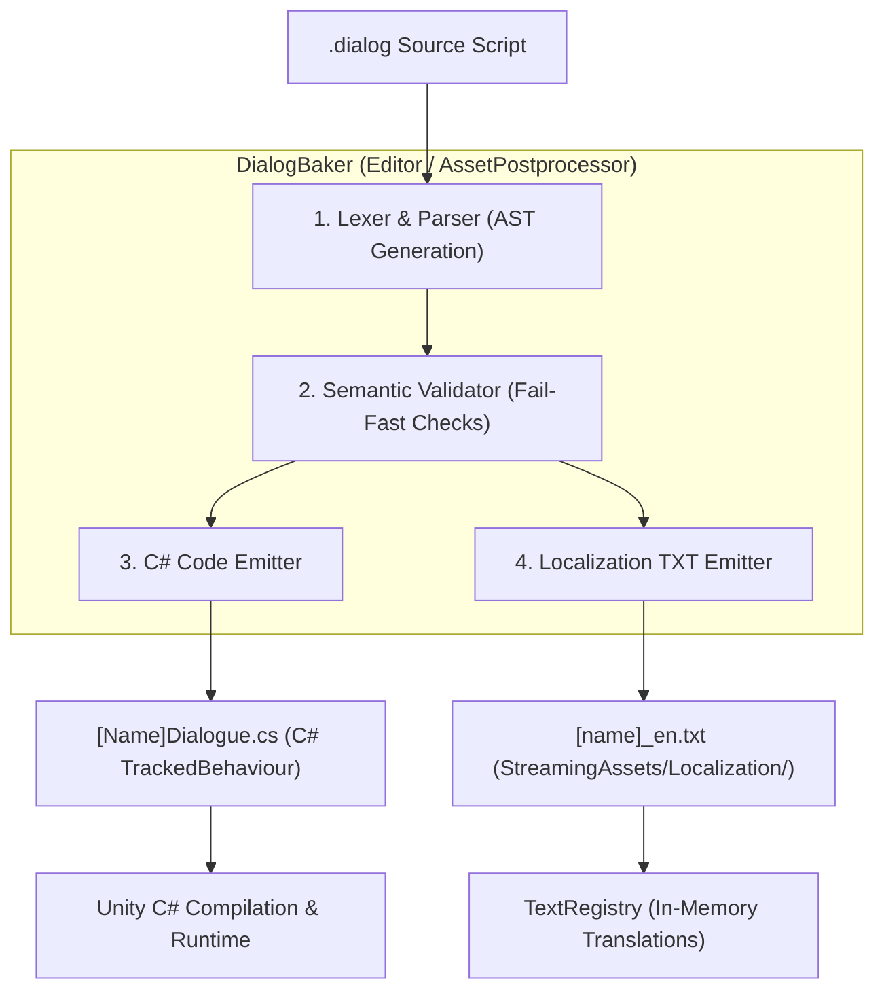

# Hollow Signal — Dialogue Compiler & Code Generation Architecture

This document details how the dialogue compilation tool (*DialogBaker*) processes a single `.dialog` DSL source file and splits it into two synchronized outputs:
1. A strongly-typed **C# `TrackedBehaviour` class** containing the node graph and state variables.
2. A **Localization plain text table (`KEY = "Value"`)** consumed by the game's `TextRegistry` from `StreamingAssets/Localization/`.

---

## 1. The Compilation Pipeline



---

## 2. Artifact 1: The Generated C# Class (`TrackedBehaviour`)

### 2.1 File Location & Naming Convention
- **Naming:** `<FileName>Dialogue.cs` (e.g., `MedicalBayConsole.dialog` $\rightarrow$ `MedicalBayConsoleDialogue.cs`).
- **Target Folder:** `Assets/Scripts/Generated/Dialogues/` (kept in an auto-generated namespace to avoid polluting manual scripts).

### 2.2 Class Hierarchy & RAII Inheritance
The generated class inherits from `DialogueBehaviour`, which inherits directly from `TrackedBehaviour`:

```
MonoBehaviour
  └── IBoundState
        └── TrackedBehaviour (Handles Blackboard reflection and RAII flush/load)
              └── DialogueBehaviour (Provides node dispatch and choice consumption)
                    └── MedicalBayConsoleDialogue (Auto-generated concrete dialogue)
```

### 2.3 Variable Generation
Declared `VAR local` statements are emitted as serialized `Tracked<T>` fields:
- `VAR local bool power_diverted = false` $\rightarrow$
  ```csharp
  [Header("Tracked Variables")]
  public Tracked<bool> power_diverted = new("power_diverted", false);
  ```
- Because `Tracked<T>` is a core engine RAII type, the fields are automatically discovered by `TrackedBehaviour.Awake()`, serialized to the entity's Blackboard partition, and inspectable in the Unity Editor.

### 2.4 One-Shot Choice State Management
`DialogueBehaviour` contains a built-in tracked collection for consumed one-shot choices:
```csharp
public Tracked<List<string>> consumedChoices = new("dlg_consumed_choices", new List<string>());
```
When a one-shot choice (`*`) is selected, its unique choice identifier is added to `consumedChoices.Value`. When checking choice visibility, the generated node automatically tests:
```csharp
!consumedChoices.Value.Contains("CHOICE_ID")
```

### 2.5 Node Graph & Delegate Compilation
Instead of interpreting text conditions at runtime, the compiler emits native C# expressions into compiled lambdas:

| DSL Syntax | Generated C# Code |
| :--- | :--- |
| `{power_diverted == false}` | `() => !power_diverted.Value` |
| `{security_level >= 2 && is_open == false}` | `() => security_level.Value >= 2 && !is_open.Value` |
| `~ SET power_diverted = true` | `() => { power_diverted.Value = true; }` |
| `~ EndCrisisTurn()` | `() => { CrisisManager.ConsumeActiveTurn(); }` |
| `(RestorePowerNodes DC 12)` | `RequiredSkill = Skill.RestorePowerNodes, TargetDC = 12` |

---

## 3. Artifact 2: The Generated Localization File

### 3.1 File Location & Format
- **Naming:** `<filename>_en.txt` (e.g., `medicalbayconsole_en.txt`).
- **Target Folder:** `Assets/StreamingAssets/Localization/`.
- **Format:** Plain text key-value format matching the rest of the game's localization files (e.g., `masteries_en.txt`):
  ```plain text
  # --- Auto-Generated Dialogue Localization Keys ---
  # Source: MedicalBayConsole.dialog

  KEY = "Translated String Value"
  ```

### 3.2 Deterministic Key Generation Algorithm
To ensure that editing or reordering dialogue text never corrupts translations, keys are generated deterministically using a hierarchical pattern:

$$\text{Key} = \text{"DLG\_"} + \text{FILE\_PREFIX} + \text{"\_"} + \text{KNOT\_NAME} + \text{"\_"} + \text{ELEMENT\_TYPE} + \text{"\_"} + \text{INDEX}$$

- `FILE_PREFIX`: Short uppercase slug of the file name (e.g., `MEDBAY`).
- `KNOT_NAME`: Name of the knot (e.g., `MAIN`, `POWERCHECK`).
- `ELEMENT_TYPE`:
  - `PROMPT`: Dialogue line spoken by NPC/Narrator.
  - `CHOICE`: Option presented to the player.
  - `SUCCESS` / `FAILURE`: Outcome line from a skill test.

#### Example Output (`medicalbayconsole_en.txt`):
```plain text
# --- Auto-Generated Dialogue Localization Keys ---
# Source: MedicalBayConsole.dialog

DLG_MEDBAY_MAIN_PROMPT_00 = "[SYS-402] Isolation Control Console. Operating on auxiliary battery power."
DLG_MEDBAY_MAIN_CHOICE_00 = "Reroute Auxiliary Power"
DLG_MEDBAY_MAIN_CHOICE_01 = "Disengage Quarantine Seals"
DLG_MEDBAY_MAIN_CHOICE_02 = "Download Incident Audio Logs"
DLG_MEDBAY_MAIN_CHOICE_03 = "Run Diagnostics"
DLG_MEDBAY_MAIN_CHOICE_04 = "Step away from terminal"
DLG_MEDBAY_POWERCHECK_SUCCESS_00 = "Power routed successfully to primary bus. Solenoid valves active."
DLG_MEDBAY_POWERCHECK_FAILURE_00 = "Breaker trip! Capacitors discharged into local junction."
```

---

## 4. End-to-End Compilation Walkthrough

### 4.1 Input Source (`MedicalBayConsole.dialog`)
```text
VAR local bool power_diverted = false

=== KNOT: Main ===
TERMINAL: Isolation Console ready.
* {power_diverted == false} [Reroute Power (RestorePowerNodes DC 12)] -> PowerCheck
+ [Leave] -> END

=== KNOT: PowerCheck ===
~ SkillCheck(RestorePowerNodes, 12)
- SUCCESS ->
    TERMINAL: Power routed.
    ~ SET power_diverted = true
    -> Main
- FAILURE ->
    TERMINAL: Fuse blown.
    -> Main
```

---

### 4.2 Output 1: `MedicalBayConsoleDialogue.cs`
```csharp
// ------------------------------------------------------------------------------
// <auto-generated>
//     Generated by Hollow Signal Dialog Baker from: MedicalBayConsole.dialog
//     DO NOT EDIT DIRECTLY. Changes will be overwritten upon re-baking.
// </auto-generated>
// ------------------------------------------------------------------------------

using System.Collections.Generic;
using Core;
using Core.Dialog;
using Data;
using UnityEngine;

namespace Generated.Dialogues {
    [DisallowMultipleComponent]
    public class MedicalBayConsoleDialogue : DialogueBehaviour {
        [Header("Tracked Variables")]
        public Tracked<bool> power_diverted = new("power_diverted", false);

        public override DialogueNode GetNode(string knotId) => knotId switch {
            "Main" => BuildNode_Main(),
            "PowerCheck" => BuildNode_PowerCheck(),
            _ => null
        };

        private DialogueNode BuildNode_Main() {
            return new DialogueNode {
                KnotId = "Main",
                SpeakerId = "TERMINAL",
                TextKey = "DLG_MEDBAY_MAIN_PROMPT_00",
                Choices = new List<DialogueChoice> {
                    new DialogueChoice {
                        ChoiceId = "MEDBAY_MAIN_C00",
                        TextKey = "DLG_MEDBAY_MAIN_CHOICE_00",
                        IsOneShot = true,
                        IsVisible = () => !consumedChoices.Value.Contains("MEDBAY_MAIN_C00") && !power_diverted.Value,
                        RequiredSkill = Skill.RestorePowerNodes,
                        TargetDC = 12,
                        TargetKnot = "PowerCheck"
                    },
                    new DialogueChoice {
                        ChoiceId = "MEDBAY_MAIN_C01",
                        TextKey = "DLG_MEDBAY_MAIN_CHOICE_01",
                        IsOneShot = false,
                        IsVisible = () => true,
                        TargetKnot = DialogueNode.End
                    }
                }
            };
        }

        private DialogueNode BuildNode_PowerCheck() {
            return new DialogueNode {
                KnotId = "PowerCheck",
                SkillCheck = new DialogueSkillCheck {
                    Skill = Skill.RestorePowerNodes,
                    TargetDC = 12,
                    OnSuccess = new DialogueOutcome {
                        SpeakerId = "TERMINAL",
                        TextKey = "DLG_MEDBAY_POWERCHECK_SUCCESS_00",
                        OnExecute = () => { power_diverted.Value = true; },
                        TargetKnot = "Main"
                    },
                    OnFailure = new DialogueOutcome {
                        SpeakerId = "TERMINAL",
                        TextKey = "DLG_MEDBAY_POWERCHECK_FAILURE_00",
                        TargetKnot = "Main"
                    }
                }
            };
        }
    }
}
```

---

### 4.3 Output 2: `medicalbayconsole_en.txt`
```plain text
# --- Auto-Generated Dialogue Localization Keys ---
# Source: MedicalBayConsole.dialog

DLG_MEDBAY_MAIN_PROMPT_00 = "Isolation Console ready."
DLG_MEDBAY_MAIN_CHOICE_00 = "Reroute Power"
DLG_MEDBAY_MAIN_CHOICE_01 = "Leave"
DLG_MEDBAY_POWERCHECK_SUCCESS_00 = "Power routed."
DLG_MEDBAY_POWERCHECK_FAILURE_00 = "Fuse blown."
```

---

## 5. Editor Integration & Build Pipeline

1. **Unity AssetPostprocessor**:
   - An editor script (`DialogAssetPostprocessor.cs`) listens to imported assets.
   - When any `.dialog` file is created or saved in the project, it automatically triggers `DialogBaker.BakeFile(path)`.
2. **Manual Bake Command**:
   - Unity menu item: `Tools -> Hollow Signal -> Bake All Dialogues` to regenerate all C# classes and localization tables in bulk.
3. **Fail-Fast Error Reporting**:
   - If a script contains an undeclared variable (e.g., `{unknown_var == true}`), an invalid skill name, or a broken divert target, the baker logs a structured Unity console error with the exact line and column number, preventing broken C# generation.
