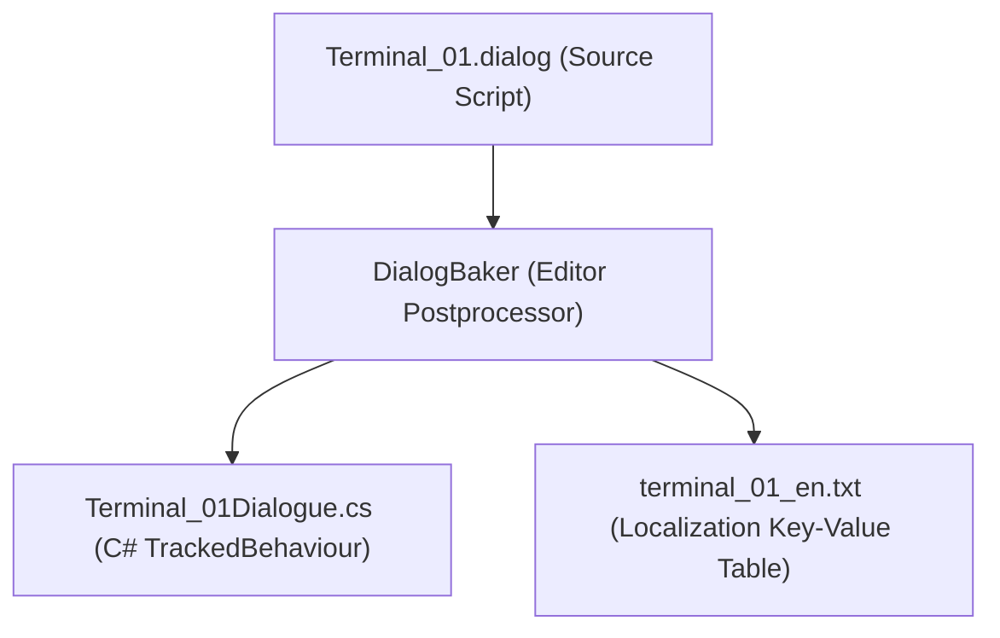

# Hollow Signal — Dialogue Script Syntax & Specification

This document defines the official syntax, language rules, and compiler expectations for Hollow Signal's proprietary dialogue scripting language (`.dialog` files).

---

## 1. Architectural Purpose & Pipeline

The `.dialog` format is a declarative narrative Domain-Specific Language (DSL) designed to be the **single source of truth** for interactive text, narrative branches, and dialogue-driven world state.

Instead of writing dialogue in text files and then manually double-scripting proxy C# classes to synchronize variables with the `Blackboard`, a custom editor compiler translates each `.dialog` file into two synchronized artifacts:



1. **Compiled C# Class (`.cs`)**:
   - Inherits from `DialogueBehaviour` (which inherits from `TrackedBehaviour`).
   - Automatically defines strongly-typed `Tracked<T>` variables for all declared dialogue state.
   - Compiles knot branches, conditions, and skill checks into native, compiled C# code with zero runtime string parsing.
2. **Localization String Table (`.txt`)**:
   - Emits standard plain text key-value pairs matching the project's existing format (`KEY = "Value"` in `Assets/StreamingAssets/Localization/`).
   - Automatically extracts spoken lines, choice texts, and prompt descriptions into deterministic string keys (e.g., `DLG_TERM01_MAIN_PROMPT`) compatible with `TextRegistry`.

---

## 2. File Anatomy

A `.dialog` file consists of three sequential parts:
1. **Header & Variable Declarations**: Defines the variables tracked by the dialogue's state.
2. **Knots (Conversation States)**: Modular text blocks containing dialogue lines and actions.
3. **Choices & Diverts**: Player options, condition gates, skill test requirements, and destination targets.

---

## 3. Syntax Rules & Directives

### 3.1 Comments
Single-line comments begin with double forward slashes `//`. The compiler ignores them entirely:
```text
// This is a comment explaining context for writers.
```

---

### 3.2 Variable Declarations (`VAR`)
Variables represent persistent state stored in the game's Blackboard via `TrackedBehaviour`. They must be declared at the top of the file before any knots.

Syntax:
```text
VAR <scope> <type> <variable_name> = <default_value>
```

- **Scope**:
  - `local`: Bound to this specific object instance's partition in the Blackboard (e.g., *Is this specific door open?*).
  - `global`: Bound to the global game session partition (e.g., *Has the station reactor exploded?*).
- **Supported Types**: `bool`, `int`, `float`, `string`.
- **Examples**:
  ```text
  VAR local bool is_unlocked = false
  VAR local int security_level = 2
  VAR local string assigned_technician = "Vane"
  VAR global bool G_SubLevel3_PowerActive = false
  ```

---

### 3.3 Knots (`=== KNOT: KnotName ===`)
A knot represents a unique conversation node or state.
- Knot names must be alphanumeric and unique within the file.
- The default entry knot when starting dialogue is **`Main`** (unless another knot name is explicitly triggered by an event).
- Syntax:
  ```text
  === KNOT: KnotName ===
  ```

---

### 3.4 Dialogue Lines & Speaker Attribution
Dialogue lines indicate who is speaking and what is said.

Syntax:
```text
SPEAKER_ID: Dialogue text goes here.
```
- `SPEAKER_ID`: Uppercase identifier identifying the character or narrator (e.g., `NARRATOR`, `TERMINAL`, `DR_VANE`, `GUARD`).
- Optional Mood / Portrait Tag: A tag enclosed in brackets before the colon indicates the speaker's emotional portrait expression:
  ```text
  DR_VANE [portrait: panicked]: We need to seal the bulkheads right now!
  ```

---

### 3.5 Choices & Diverts

Choices are player options displayed in the dialogue UI. Every choice specifies its text inside square brackets `[...]` and a target knot destination using a divert arrow `->`.

#### Choice Types:
- `*` **One-Shot Choice**: Disappears forever once selected. The compiler tracks its selection status automatically in the local partition so it never repeats.
- `+` **Sticky Choice**: Always available whenever the knot is visited (used for repeatable questions, menu returns, or exiting).

#### Divert Destinations:
- `-> KnotName`: Jumps to the specified knot.
- `-> END`: Closes the dialogue interface and returns control to gameplay.

#### Condition Gating `{...}`:
Prefixing a choice with `{expression}` makes the choice visible or interactable only if the expression evaluates to `true`:
```text
* {is_unlocked == false && security_level >= 2} [Disengage Hydraulic Locks] -> UnlockSequence
```

#### Skill Check Annotation `(...)`:
Enclosing a skill test definition inside the choice brackets instructs the compiler to generate a skill check challenge:
```text
* [Bypass Security Subroutine (HackCircuits DC 14)] -> HackAttempt
```
- **Syntax**: `(<SkillEnum> DC <Integer>)`
- The compiler maps `<SkillEnum>` to the existing `Data.Skill` enum (e.g., `HackCircuits`, `PickLocks`, `Sprint`, `Perceive`).
- The UI automatically renders a skill badge showing the skill name, character's current modifier, and target DC.

---

### 3.6 In-Line Actions & State Mutations (`~`)
Lines prefixed with a tilde `~` execute logic, variable mutations, or gameplay events.

#### Variable Assignment:
```text
~ SET is_unlocked = true
~ SET security_level = security_level + 1
~ SET G_SubLevel3_PowerActive = true
```

#### Gameplay & Crisis Commands:
```text
~ EndCrisisTurn()               // Consumes active character's Action slot during Crisis
~ StartCrisis("Ambush_Encounter_01") // Triggers turn-based combat
~ GiveItem("Keycard_Level2", 1) // Adds an item to the party inventory
~ TakeItem("Repair_Fuse", 1)    // Removes an item from the party inventory
```

---

### 3.7 Skill Check Resolution Blocks
When a knot represents a skill check roll, it specifies the test and branches based on the outcome:

Syntax:
```text
=== KNOT: HackAttempt ===
~ SkillCheck(HackCircuits, 14)
- SUCCESS ->
    TERMINAL: Access granted. System administrator privileges enabled.
    ~ SET is_unlocked = true
    -> Main
- FAILURE ->
    TERMINAL: Security violation detected! Feedback pulse released.
    ~ EndCrisisTurn()
    -> END
```

Outcomes supported:
- `- SUCCESS ->`
- `- FAILURE ->`
- `- CRITICAL_SUCCESS ->` (Optional)
- `- CRITICAL_FAILURE ->` (Optional)

---

## 4. Comprehensive Real-World Example

Below is a complete, production-ready `.dialog` script demonstrating all syntax features:

```text
// ==============================================================================
// MedicalBayConsole.dialog
// Interactive terminal controlling the isolation ward in Sub-Level 2
// ==============================================================================

// 1. VARIABLE DECLARATIONS
VAR local bool power_diverted = false
VAR local bool logs_downloaded = false
VAR local int access_attempts = 0
VAR global bool G_MedBayQuarantineLifted = false

// 2. CONVERSATION KNOTS

=== KNOT: Main ===
TERMINAL: [SYS-402] Isolation Control Console. Operating on auxiliary battery power.

* {power_diverted == false} [Reroute Auxiliary Power (RestorePowerNodes DC 12)] -> PowerCheck
* {power_diverted == true && G_MedBayQuarantineLifted == false} [Disengage Quarantine Seals] -> OpenSeals
* {logs_downloaded == false} [Download Incident Audio Logs] -> DownloadLogs
+ [Run Diagnostics] -> Diagnostics
+ [Step away from terminal] -> END

=== KNOT: PowerCheck ===
~ SkillCheck(RestorePowerNodes, 12)
- SUCCESS ->
    TERMINAL: Power routed successfully to primary bus. Solenoid valves active.
    ~ SET power_diverted = true
    ~ EndCrisisTurn()
    -> Main
- FAILURE ->
    TERMINAL: Breaker trip! Capacitors discharged into local junction.
    ~ SET access_attempts = access_attempts + 1
    ~ EndCrisisTurn()
    -> Main

=== KNOT: OpenSeals ===
~ SET G_MedBayQuarantineLifted = true
~ EndCrisisTurn()
TERMINAL: Depressurization complete. Quarantine blast door unsealed.
-> END

=== KNOT: DownloadLogs ===
~ SET logs_downloaded = true
TERMINAL: Downloading encrypted telemetry... Done.
NARRATOR: You secure the audio logs onto your datapad. Voices from the lower deck echo with distress.
-> Main

=== KNOT: Diagnostics ===
TERMINAL: System integrity: 42%. Environmental control: OFFLINE. Bio-hazard containment: BREACHED.
-> Main
```

---

## 5. Generated Artifacts Reference

When the compiler processes `MedicalBayConsole.dialog`, it produces:

### 1. `MedicalBayConsoleDialogue.cs` (C# Tracked Component)
- Contains `public Tracked<bool> power_diverted = new("power_diverted", false);`
- Contains `public Tracked<bool> logs_downloaded = new("logs_downloaded", false);`
- Contains `public Tracked<int> access_attempts = new("access_attempts", 0);`
- Implements `public override DialogueNode GetNode(string knotId)` returning native delegates for conditions (`() => !power_diverted.Value`), skill checks (`Skill.RestorePowerNodes`, `12`), and mutations (`() => power_diverted.Value = true;`).

### 2. `medicalbayconsole_en.txt` (Standard Key-Value Localization File)
- Saved in `Assets/StreamingAssets/Localization/`:
  ```plain text
  # --- Auto-Generated Dialogue Localization Keys ---
  # Source: MedicalBayConsole.dialog

  DLG_MEDBAY_MAIN_PROMPT_00 = "[SYS-402] Isolation Control Console. Operating on auxiliary battery power."
  DLG_MEDBAY_MAIN_CHOICE_00 = "Reroute Auxiliary Power"
  DLG_MEDBAY_MAIN_CHOICE_01 = "Disengage Quarantine Seals"
  DLG_MEDBAY_MAIN_CHOICE_02 = "Download Incident Audio Logs"
  DLG_MEDBAY_MAIN_CHOICE_03 = "Run Diagnostics"
  DLG_MEDBAY_MAIN_CHOICE_04 = "Step away from terminal"
  DLG_MEDBAY_POWERCHECK_SUCCESS_00 = "Power routed successfully to primary bus. Solenoid valves active."
  DLG_MEDBAY_POWERCHECK_FAILURE_00 = "Breaker trip! Capacitors discharged into local junction."
  ```

---

## 6. Development Philosophies Alignment

- **Fail-Fast**: Invalid variable names or type mismatches in `.dialog` cause immediate C# compiler errors upon generation.
- **Zero Double-Scripting**: State variables and their types are declared once in `.dialog`.
- **Pure Memory Performance**: Running dialogue evaluates compiled C# boolean lambdas directly; no string evaluation or runtime lexing during gameplay.
- **Full Blackboard Compatibility**: Uses existing `TrackedBehaviour` and RAII save/load cycles without manual dictionary plumbing.
- **Consistent Localization**: Uses the exact plain text `KEY = "Value"` format used across the rest of the game in `StreamingAssets/Localization/`.
