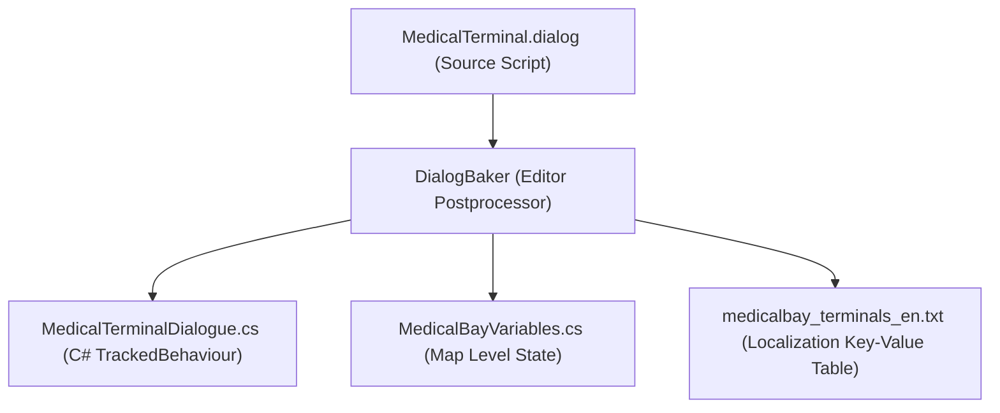

# Hollow Signal — Dialogue Script Syntax & Specification

This document defines the official syntax, language rules, and compiler expectations for Hollow Signal's proprietary dialogue scripting language (`.dialog` files).

---

## 1. Architectural Purpose & Pipeline

The `.dialog` format is a declarative narrative Domain-Specific Language (DSL) designed to be the **single source of truth** for interactive text, narrative branches, and dialogue-driven world state.

Instead of writing dialogue in text files and then manually double-scripting proxy C# classes to synchronize variables with the `Blackboard`, a custom editor compiler translates each `.dialog` file into two synchronized artifacts:



1. **Compiled C# Class (`.cs`)**:
   - Inherits from `DialogueBehaviour` (which inherits from `TrackedBehaviour`).
   - Automatically defines strongly-typed `Tracked<T>` variables for all declared local dialogue state.
   - Compiles knot branches, conditions, and skill checks into native, compiled C# code with zero runtime string parsing.
2. **Localization String Table (`.txt`)**:
   - Emits standard plain text key-value pairs matching the project's existing format (`KEY = "Value"` in `Assets/StreamingAssets/Localization/`).
   - Automatically groups and batches dialogues sharing the same `LOC_FILE: <FileName>` into a single file to keep memory footprint lean and manageable.
   - Prefixes all string keys with the dialogue script name (`DLG_<FILE>_<KNOT>_<TYPE>_<INDEX>`) to guarantee zero key collisions.

---

## 2. File Anatomy

A `.dialog` file consists of three sequential parts:
1. **Header Declarations**: Declares the associated `MAP:`, target `LOC_FILE:`, and `VAR` scopes.
2. **Knots (Conversation States)**: Modular text blocks containing dialogue lines and actions.
3. **Choices & Diverts**: Player options, condition gates, item requirements, tactical resource modifiers, and destination targets.

---

## 3. Syntax Rules & Directives

### 3.1 Comments
Single-line comments begin with double forward slashes `//`. The compiler ignores them entirely:
```text
// This is a comment explaining context for writers.
```

---

### 3.2 Header Directives (`MAP:` & `LOC_FILE:`)
Declared at the very top of the `.dialog` file before any knots or variables:

- **`MAP: <MapName>`**: Declares which map scene this dialogue belongs to (e.g., `MAP: MedicalBay`).
  - Used by the baker to bind typed accessors (`Map.generator_power.Value`).
  - Used to synchronize map variables into `Assets/Scripts/Generated/Maps/<MapName>Variables.cs`.
- **`LOC_FILE: <FileName>`**: Declares the destination localization file (without extension, e.g., `LOC_FILE: MedicalBay_terminals` or `LOC_FILE: DrVance`).
  - If specified, the compiler batches all dialogue scripts declaring this same `LOC_FILE` into `Assets/StreamingAssets/Localization/<FileName>_en.txt`.
  - Enables loading and unloading specific localization tables on-demand via `LocalizationManager.LoadTable("<FileName>")` and `UnloadTable("<FileName>")`.

```text
MAP: MedicalBay
LOC_FILE: MedicalBay_terminals
```

---

### 3.3 Variable Declarations (`VAR`)
Variables represent persistent state stored in the game's Blackboard via `TrackedBehaviour`. They must be declared at the top of the file before any knots.

Syntax:
```text
VAR <scope> <type> <variable_name> = <default_value>
```

- **Scope**:
  - `local`: Bound to this specific object instance's partition in the Blackboard (e.g., *Is this specific terminal hacked?*).
  - `map`: Bound to the current map/level scene partition via `<MapName>Variables.cs` (e.g., *Is the emergency generator running?*).
  - `global`: Bound to the persistent game session partition via `SessionDialogVariables.cs` (e.g., *Has the station reactor exploded?*).
- **Supported Types**: `bool`, `int`, `float`, `string`.
- **Examples**:
  ```text
  VAR local bool is_unlocked = false
  VAR map bool generator_online = false
  VAR global bool G_QuarantineLifted = false
  ```

---

### 3.4 Knots (`=== KNOT: KnotName ===`)
A knot represents a unique conversation node or state.
- Knot names must be alphanumeric and unique within the file.
- The default entry knot when starting dialogue is **`Main`** (unless another knot name is explicitly triggered by an event).
- Syntax:
  ```text
  === KNOT: KnotName ===
  ```

---

### 3.5 Dialogue Lines & Speaker Attribution
Dialogue lines indicate who is speaking and what is said.

Syntax:
```text
SPEAKER_ID: Dialogue text goes here.
SPEAKER_ID [portrait: mood_tag]: Spoken dialogue with portrait emotion.
```

---

### 3.6 Choices (`*` and `+`)
Choices present clickable options to the player.
- **One-shot choice (`*`)**: Once selected by the player, it is consumed and never appears again.
- **Repeatable choice (`+`)**: Always visible whenever its conditions are met.
- **Conditions (`{condition}`)**: Native C# boolean expression evaluated before displaying.
- **Item Gating (`(item: ItemId xCount)`)**: Requires the specified item in party inventory.
- **Divert target (`-> KnotName` or `-> END`)**: The knot to transition to when chosen.

Syntax:
```text
* [One-time question] -> AnswerKnot
+ [Repeatable question] -> AnswerKnot
* {!is_hacked} [Bypass terminal security (item: Keycard_Blue x1)] -> HackNode
+ {generator_online == true} [Access diagnostic logs] -> LogsNode
+ [Step away] -> END
```

---

### 3.7 Tactical Crisis Turn Modifiers (`<!>`, `<!!>`, `<M>`)
In Hollow Signal, dialogue can occur seamlessly during **Crisis Mode (turn-based tactical combat)**. Choices can declare tactical budget costs directly in the bracketed option text:

| Tag | Tactical Resource Cost | Crisis Presentation & Hover Tooltip |
| :--- | :--- | :--- |
| `<!>` | **Consumes Major Action** | Rendered in **Bold Orange** (`DialogueColorTheme.ActionCostColor`). Tooltip: *"Consumes Major Action"* |
| `<!!>` | **Ends Character Turn** (consumes Action, Move, and Dash) | Rendered in **Bold Red** (`DialogueColorTheme.EndTurnCostColor`). Tooltip: *"Ends Turn (Consumes Action, Move, and Dash)"* |
| `<M>` | **Consumes Move & Burns Sprint** | Rendered in **Bold Blue** (`DialogueColorTheme.MoveCostColor`). Tooltip: *"Consumes Movement (Dash / Double Move disabled)"* |

#### Tactical Integration Rules:
1. **Symbol Stripping**: Raw modifier tags (`<!>`, `<!!>`, `<M>`) are parsed by the compiler/UI and **never** appear in the visible choice text.
2. **Crisis Availability & Budget Gating**:
   - If a character has already acted (`turn.HasActed == true`), `<!>` and `<!!>` choices are **disabled** (grayed out with `DialogueColorTheme.DisabledChoiceColor`, unclickable, with a tooltip explaining unavailable action).
   - If a character has already moved (`turn.HasMoved == true`), `<M>` choices are **disabled** (grayed out and unclickable).
3. **Dash / Sprint Lockout (`<M>`)**:
   - Marking a choice `<M>` is agnostic of the double-move dash mechanic: picking it burns **both** the movement and the ability to roll an athletics sprint test for a second move this round (`canSprint = false`).
4. **Real-Time Exploration Mode**:
   - When outside Crisis mode (`CrisisManager.Instance.IsCrisis == false`), all choices are freely selectable, styled in normal weight and default colors, without special tactical badges or cost restrictions.
5. **Color Compendium**:
   - All visual colors and styling are configured in [`DialogueColorTheme.cs`](file:///C:/Users/Thiago/Desktop/Personal%20Projects/Horror%20Room/Hollow%20Signal/Hollow%20Signal/Assets/Scripts/UI/Dialog/DialogueColorTheme.cs).

Syntax:
```text
* [<!> Brute force the jammed manual bypass] -> ForceOpenNode
* [<!!> Lock down the bulkhead doors and seal the sector] -> LockdownNode
+ [<M> Scavenge the nearby control panel for wiring] -> ScavengeNode
```

---

### 3.8 In-line Commands (`~`)
Commands execute side effects or mutations:
```text
~ SET is_unlocked = true
~ EndCrisisTurn()
```

---

### 3.9 Skill Check Resolution Blocks
When a knot represents a skill check roll, it specifies the test and branches based on the outcome:

Syntax:
```text
=== KNOT: HackAttempt ===
~ SkillCheck(HackCircuits, 14)
- SUCCESS ->
    TERMINAL: Access granted. System administrator privileges enabled.
    ~ SET is_unlocked = true
    -> Main
- FAILURE ->
    TERMINAL: Security violation detected! Feedback pulse released.
    ~ EndCrisisTurn()
    -> Main
```

---

## 4. Comprehensive Real-World Example

```text
// ==============================================================================
// MedicalTerminal.dialog
// Interactive terminal controlling isolation ward in Medical Bay
// ==============================================================================

MAP: MedicalBay
LOC_FILE: MedicalBay_terminals

// 1. VARIABLE DECLARATIONS
VAR local  bool is_terminal_hacked = false
VAR map    bool generator_power = false
VAR global bool G_QuarantineActive = false

// 2. CONVERSATION KNOTS

=== KNOT: Main ===
TERMINAL [portrait: alert]: Medical containment console online. Auxiliary power required.
* {!is_terminal_hacked} [<!> Bypass terminal security (item: Keycard_Blue x1)] -> HackNode
+ {generator_power == true} [<M> Access patient logs and telemetry] -> LogsNode
* [<!!> Initiate emergency containment lockdown] -> LockdownNode
+ [Step away] -> END

=== KNOT: HackNode ===
~ SkillCheck(HackCircuits, 12)
- SUCCESS ->
    TERMINAL: Security protocol disabled.
    ~ SET is_terminal_hacked = true
    -> Main
- FAILURE ->
    TERMINAL: Access denied. Alarm triggered.
    -> Main

=== KNOT: LogsNode ===
TERMINAL: Dr. Vance report: Subject 07 escaped quarantine.
+ [Return to main menu] -> Main

=== KNOT: LockdownNode ===
TERMINAL: Bulkheads sealed. Turn concluded.
-> END
```
