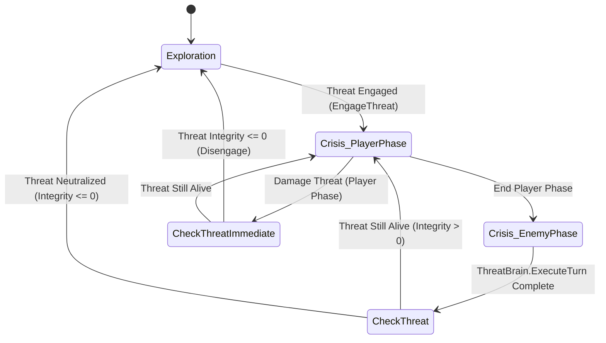

# Hollow Signal — Enemy & Crisis Design Considerations

This document establishes the architecture, encounter lifecycle, and behavioral framework for Enemies and the Crisis (Combat) System in *Hollow Signal*, heavily inspired by the **Cypher System** philosophy.

---

## 1. Core Paradigm: Crisis as a Two-Roster Encounter

A **Crisis** is not an arbitrary binary timer or standalone state toggle. Structurally, a Crisis is an active confrontation between two opposing rosters:

$$\mathbf{Active\ Party\ (Heroes)} \quad \text{vs.} \quad \mathbf{Active\ Threat\ (Encounter)}$$

```
                   ┌──────────────────────────────────┐
                   │          CrisisManager           │
                   ├──────────────────────────────────┤
                   │  • ActivePartyMembers (Heroes)   │
                   │  • ActiveThreat (Encounter)      │
                   └──────────────────────────────────┘
                               ▲          ▲
             Registration /    │          │    Integrity <= 0 /
             Trigger / Ambush  │          │    Disengage / Pacification
                               │          │
                     [Exploration]        [ActiveThreat]
```

### 1.1 What "Tripping a Crisis" Means
A Crisis begins when an active threat is engaged:
* **Patrol / Stealth Detection**: An enemy detects the party and enters `Engaged` state.
* **Ambush / Trigger Volume**: Walking past an entry threshold trips an `EffectTriggerVolume` running `EngageThreatEffect`.
* **Narrative Escalation**: A dialogue branch terminates in violence, executing `EngageThreatEffect`.
* **Environmental Alarm**: A console or environmental malfunction alerts nearby threats.

**Immediate Outcome**: When a threat is engaged and `CrisisManager` is in `Exploration`, `CrisisManager.StartCrisis()` fires automatically:
1. World clock enters combat rounds (`RoundNumber = 1`).
2. Active party docks to their closest available `TacticalSlot`s (`DockPartyToClosestSlots()`).
3. Combat phase transitions to `PlayerPhase`.

---

## 2. Spatial Philosophy: Zones are for Enemies, Slots are for Players

A central rule of the combat architecture:

> **Slots are a Player mechanic. Enemies control, navigate, and affect Areas (TacticalZones).**

* **Players** occupy discrete **`TacticalSlot`s** (cover nodes, workstations, vantage points) within a Voronoi `TacticalZone`.
* **Enemies / Threats** do not dock into player slots. They anchor to, navigate between, and control **`TacticalZone`s**.
* When a threat performs an action targeting an area, it operates on the `TacticalZone` and affects heroes occupying `childSlots` inside that zone.

---

## 3. The Three Threat Archetypes

Every enemy encounter in *Hollow Signal* collapses into one of three archetypes, all governed by the unified [`ThreatSheet`](file:///C:/Users/Thiago/Desktop/Personal%20Projects/Horror%20Room/Hollow%20Signal/Hollow%20Signal/Assets/Scripts/World/Threats/ThreatSheet.cs):

```
                      ┌──────────────────────────────────────┐
                      │             THREAT SHEET             │
                      │  (Integrity, Escalation, AP, Deck)   │
                      └──────────────────┬───────────────────┘
                                         │
                 ┌───────────────────────┼──────────────────────┐
                 ▼                       ▼                      ▼
        [ SINGLE MONSTER ]         [ ENVIRONMENT ]           [ SWARM / ARMY ]
         1 Physical Pawn           No pawn: Zones are        Distributed unit
         moves zone-to-zone.       hazardous; consoles       counts per zone.
         Clickable / Dialogue.     in slots are clickable.   Engulfs areas.
```

### 3.1 Single Monster (Physical Predator)
* **Spatial Presence**: Occupies exactly 1 `TacticalZone` at any time (`CurrentZone`). Moving to a new area sets its destination on the NavMesh.
* **Interaction**: Has an optional physical world pawn (`ThreatPawn`) with a collider that opens combat dialogue or problem knots when clicked.
* **Control**: Holds zone control value = `1` in its current zone, `0` elsewhere.

### 3.2 Environment (Hazard / Catastrophe)
* **Spatial Presence**: Controls multiple zones simultaneously (e.g., Room A = 3 fire intensity, Room B = 1 smoke). Has no moving character pawn.
* **Interaction**: Players do not click "the fire". Players interact with **Workstation Slots** (sprinkler valves, power breakers, airlock terminals) that execute effects against the threat.
* **Control**: Dynamic integer control values per zone representing hazard intensity.

### 3.3 Swarm / Army (Crowd / Infestation)
* **Spatial Presence**: Instead of simulating dozens of individual pathfinding agents, the swarm distributes **unit counts** across `TacticalZone`s (e.g. Zone A: 12 cultists, Zone B: 4 cultists).
* **Interaction**: Visual flock/tokens rendered in zones (via OpenVAT or instanced meshes). Attacking into a zone damages the zone's control/unit count and drains master integrity.
* **Control**: Zone control integer represents active combatants in that sector.

---

## 4. Encounters & Multi-Threat Infighting (Self-Harm Cards)

Rather than having multiple independent threats taking conflicting turns, complex encounters (e.g. an army fighting inside a burning bunker) are modeled as a **unified encounter threat**:
* The threat holds cards that represent both sides of the chaos.
* Cards can be flagged **`isSelfHarm = true`**: When drafted, the card damages or drains the threat's own integrity while simultaneously subjecting player heroes in the zone to hazard effects.
* This allows hostile forces and environmental catastrophes to naturally consume each other during combat rounds without complex multi-faction scheduler overhead.

---

## 5. Threat Data Architecture

### 5.1 [`ThreatSheet.cs`](file:///C:/Users/Thiago/Desktop/Personal%20Projects/Horror%20Room/Hollow%20Signal/Hollow%20Signal/Assets/Scripts/World/Threats/ThreatSheet.cs)
Inherits from `Sheet` (integrating with `TrackedTransform`, `UniqueId`, and `BlackboardClient` save/load). Pure encounter logic—**not** `ISelectable`.

* **Universal Attributes**:
  * `Integrity` (`VitalityPool`): The generic elimination pool. Reaching 0 triggers `OnThreatNeutralized` and disengages the crisis.
  * `ThreatLevel` (`Tracked<int>`): Cypher tier (1–10).
  * `Escalation` (`Tracked<int>`): Doom clock / rage / fire spread timer (0–100%).
  * `UnitCount` (`Tracked<int>`): Active combatant count for swarms/armies.
  * `ActionPoints` (`Tracked<int>`): Turn budget replenished each round.
* **Generic Zone Control**:
  * `Dictionary<TacticalZone, int> _zoneControl`: Maps any tactical zone to an integer score (presence, units, or intensity).
  * `GetZoneControl(zone)`, `SetZoneControl(zone, count)`, `ModifyZoneControl(zone, delta)`, `ControlsZone(zone)`.
* **String Tag Bag**:
  * `HashSet<string> _tags`: Status keywords currently active on the threat (`AddTag`, `RemoveTag`, `HasTag`).
* **Arbitrary Attribute Toolbox**:
  * Key-value float store (`GetAttribute`, `SetAttribute`, `ModifyAttribute`) persisted to blackboard state.

### 5.2 [`ThreatActionCard.cs`](file:///C:/Users/Thiago/Desktop/Personal%20Projects/Horror%20Room/Hollow%20Signal/Hollow%20Signal/Assets/Scripts/World/Threats/ThreatActionCard.cs) & [`ThreatDeck.cs`](file:///C:/Users/Thiago/Desktop/Personal%20Projects/Horror%20Room/Hollow%20Signal/Hollow%20Signal/Assets/Scripts/World/Threats/ThreatDeck.cs)
* **`ThreatActionCard`** (`ScriptableObject`):
  * `apCost`, `minEscalation`, `cooldownTurns`, `aiWeight`, `isSelfHarm`.
  * `ThreatTargetType`: `Self`, `CurrentZone`, `ControlledZones`, `AdjacentZone`, `ZoneWithMostHeroes`, `Global`.
  * `Execute(source, targetZone, onComplete)`: Automatically runs payload effects on the threat and all heroes occupying slots in the target zone.
* **`ThreatDeck`**:
  * Holds action cards, tracks per-card cooldown turns across rounds, and queries `GetPlayableCards(escalation, ap)`.

### 5.3 Specialized Threat Brains ([`ThreatBrain.cs`](file:///C:/Users/Thiago/Desktop/Personal%20Projects/Horror%20Room/Hollow%20Signal/Hollow%20Signal/Assets/Scripts/World/Threats/ThreatBrain.cs))
* Abstract base class with two core responsibilities:
  1. `ExecuteTurn(Action onTurnComplete)`: AI turn drafting and action execution during `EnemyPhase`.
  2. `ProcessImpact(ImpactPayload payload)`: Custom damage math, resistance rules, and status reaction handling.
* **Specialized Implementations**:
  * Rather than creating an abstract generic token engine, designers implement specialized C# brains (e.g. `BurningHouseBrain`, `CultistSwarmBrain`, `StalkerAlienBrain`) inheriting `ThreatBrain` and writing direct, clear C# logic.

---

## 6. Items, Cyphers & The Impact Payload Pattern

Items, skills, and Cyphers do not mutate enemy state directly. Instead, they bundle proposed changes into an **`ImpactPayload`** and ship it to the threat:

```
[ Player Item / Cypher / Skill / Console ]
                    │
                    ▼  Packages intent
         [ ImpactPayload ]
         • globalDamage: int
         • globalDamageTypes: ["fire", "kinetic", ...]
         • globalTags: ["concussion", "pinned", ...]
         • areaImpacts: [ { zone: ZoneA, amount: 4, impactTypes: ["explosion"] } ]
                    │
                    ▼  threat.ReceiveImpact(payload)
      [ ThreatBrain.ProcessImpact(payload) ]
                    │
   ┌────────────────┴────────────────┐
   ▼                                 ▼
[ Hazard Brain ]              [ Swarm Brain ]
• Immune to explosion         • AoE explosion multiplies
• Water reduces control         casualties by 2x
• Fire increases escalation   • Deducts zone unit count
```

### 6.1 Payload Structures ([`ImpactPayload.cs`](file:///C:/Users/Thiago/Desktop/Personal%20Projects/Horror%20Room/Hollow%20Signal/Hollow%20Signal/Assets/Scripts/World/Threats/ImpactPayload.cs))
```csharp
[Serializable]
public struct AreaImpact{
    public TacticalZone zone;
    public int amount;
    public List<string> impactTypes;
}

[Serializable]
public class ImpactPayload{
    public int globalDamage;
    public List<string> globalDamageTypes;
    public List<string> globalTags;
    public List<AreaImpact> areaImpacts;
}
```

### 6.2 Specialized Brain Interpretation Examples
* **Hazard (Fire)**:
  * If payload contains `"kinetic"` or `"explosion"`, ignore it (immune).
  * If payload contains `"water"`, reduce zone control points and deal double integrity damage.
  * If payload contains `"fire"`, increase `Escalation` (fuel feeds the inferno).
* **Swarm (Crowd)**:
  * If payload contains `"explosion"` in Zone A, damage scales with units present in Zone A.
  * Deducts units from `threat.ModifyZoneControl(zone, -casualties)` and `unitCount`.
  * If payload has tag `"concussion"`, adds tag `"disoriented"` to the threat.
* **Single Monster**:
  * Checks if `impact.zone == Threat.CurrentZone`. Deals direct damage to `Integrity`.

---

## 7. Combat as Dialogue: The Problem Knot Pattern

Rather than requiring an entirely separate, heavy combat action UI, attacking a monster or neutralizing a threat leverages the game's existing **Dialogue Problem Archetype** engine:

1. A player character docks to a slot adjacent to the threat (or terminal) and interacts.
2. The dialogue engine opens a lightweight **Problem Knot**:
   ```text
   === KNOT: Attack_BioStalker ===
   NARRATOR: The creature bristles, claws clicking against the metal grate.
   ~ Problem(Beast: 3)
   - SUCCESS ->
       ~ DamageThreat(target, 4)
       -> END
   - FAILURE ->
       ~ RetaliateDamage(player, 2)
       -> END
   ```
3. The UI automatically displays the available approaches from the database based on the hero's equipped tools and masteries (*Bludgeon*, *Sever*, *Intimidate*, *Dodge*).
4. The 3d6 Cypher roll resolves: damage is applied to the threat's `VitalityPool`, conditions are applied, and the turn continues.

---

## 8. Tactical Slot Disengage: The "Step Aside" Fallback Mechanic

### 8.1 The Bottleneck Problem
When fighting a monster or operating a critical console:
* The slot adjacent to the monster (or in front of the terminal) is a high-value **Workstation Slot**.
* If Hero A attacks the monster and remains docked in that slot, the slot is marked occupied (`IsAvailable = false`).
* Hero B is now completely blocked from stepping up to strike the monster or access the terminal on the same turn.

### 8.2 The Solution: "Detach & Relocate to Fallback Slot"
Upon completing an interaction (attack, console hack, or valve turn), the hero executes a **Fallback Relocation**:
1. Hero vacates the featured workstation slot (`character.LeaveSlot()`).
2. Parent zone queries `zone.GetBestAvailableFallbackSlot(character.WorldPosition)`.
3. Hero smoothly walks along NavMesh to the nearest unoccupied, non-featured idle slot and docks (`character.movement.MoveToSlot(fallbackSlot)`).
4. The high-value workstation slot is immediately free for teammate access.

### 8.3 Dialogue Syntax & Tags (`<!F>`, `<!!F>`, `<F>`)
| Tag | Meaning | Tactical Resource Cost & Slot Action |
| :--- | :--- | :--- |
| `<!>` | Standard Action | Consumes Major Action. Stays in current slot. |
| `<!!>` | Standard End Turn | Consumes Action + Move. Stays in current slot. |
| **`<!F>`** | **Action + Fallback** | Consumes Major Action. Upon completion, hero vacates and relocates to a nearby non-featured slot. |
| **`<!!F>`** | **End Turn + Fallback** | Ends hero turn. Vacates and relocates to a nearby non-featured slot. |
| **`<F>`** | **Free Fallback** | Minor or zero-cost action. Vacates and relocates to fallback slot immediately. |

---

## 9. Crisis Lifecycle & Auto-Resolution

Crisis termination is driven by continuous state validation rather than manual buttons:



### 9.1 Termination Conditions
1. **Lethal Clearance**: Threat `Integrity.IsDead == true`.
2. **Environmental Neutralization**: Console/valve interaction fires `DisengageThreatEffect`.
3. **Fleeing / Disengagement**: Scripted trigger fires `CrisisManager.DisengageThreat()`.

When the active threat is disengaged, `CrisisManager.EndCrisis()` executes automatically, returning the party to exploration.

---

## 10. Implementation Status & Next Steps

- [x] **Core Threat Architecture**:
  - [`ThreatSheet.cs`](file:///C:/Users/Thiago/Desktop/Personal%20Projects/Horror%20Room/Hollow%20Signal/Hollow%20Signal/Assets/Scripts/World/Threats/ThreatSheet.cs) (Integrity, Level, Escalation, Units, AP, Zone Control, Tags, Attributes).
  - [`ThreatActionCard.cs`](file:///C:/Users/Thiago/Desktop/Personal%20Projects/Horror%20Room/Hollow%20Signal/Hollow%20Signal/Assets/Scripts/World/Threats/ThreatActionCard.cs) & [`ThreatDeck.cs`](file:///C:/Users/Thiago/Desktop/Personal%20Projects/Horror%20Room/Hollow%20Signal/Hollow%20Signal/Assets/Scripts/World/Threats/ThreatDeck.cs) (Action cards, AP economy, self-harm cards).
  - [`ThreatBrain.cs`](file:///C:/Users/Thiago/Desktop/Personal%20Projects/Horror%20Room/Hollow%20Signal/Hollow%20Signal/Assets/Scripts/World/Threats/ThreatBrain.cs) & [`WeightedThreatBrain.cs`](file:///C:/Users/Thiago/Desktop/Personal%20Projects/Horror%20Room/Hollow%20Signal/Hollow%20Signal/Assets/Scripts/World/Threats/Brains/WeightedThreatBrain.cs).
  - [`ImpactPayload.cs`](file:///C:/Users/Thiago/Desktop/Personal%20Projects/Horror%20Room/Hollow%20Signal/Hollow%20Signal/Assets/Scripts/World/Threats/ImpactPayload.cs) (`AreaImpact` and transaction payload pattern).
- [x] **Crisis Manager Combat Loop**:
  - [`CrisisManager.cs`](file:///C:/Users/Thiago/Desktop/Personal%20Projects/Horror%20Room/Hollow%20Signal/Hollow%20Signal/Assets/Scripts/Core/Crisis/CrisisManager.cs) `EngageThreat()`, `DisengageThreat()`, and `activeThreat.Brain.ExecuteTurn` integration.
- [x] **Effect Nodes**:
  - `DamageThreatEffect.cs`, `EngageThreatEffect.cs`, `DisengageThreatEffect.cs`.
- [ ] **Next Steps**:
  - **`ThreatPawn` Component**: Lightweight bridge for single monsters with 3D models and colliders to handle selection and click-to-attack without bloating `ThreatSheet`.
  - **Sample Archetype Brains**: Implement starter specialized brains (`HazardThreatBrain`, `SwarmThreatBrain`) demonstrating custom `ProcessImpact` logic.
  - **Problem Knot Combat Linking**: Connect clicking a `ThreatPawn` to trigger dialogue problem knots with fallback relocation tags.
