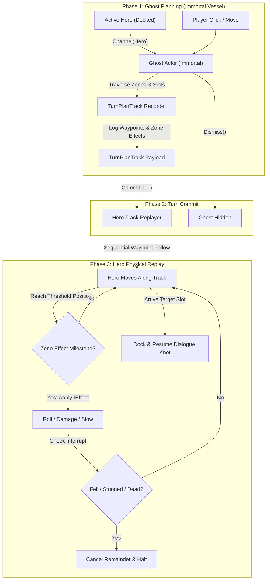

# Ghost Turn Planning & Zone Hazards Architecture

## Overview
During turn-based **Crisis Mode**, tactical decisions are not resolved instantaneously in the physical world. Instead, the player projects their active hero into an immortal, hazard-immune **Ghost Actor**. The Ghost traverses tactical zones and slots freely, evaluating dialogue options and recording environmental hazard encounters into a deterministic plan (**`TurnPlanTrack`**).

Once the turn is committed:
1. The Ghost dismisses.
2. The real hero physically walks the recorded path.
3. Environmental effects (damage, slip/fall checks, stamina drain) fire sequentially at the exact coordinates where the Ghost crossed zone thresholds.
4. Knockdowns or fatal injuries immediately interrupt and truncate the remaining movement sequence.

---

## The 4 Implementation Steps

### Step 1: `TurnPlanTrack` Data Structures & `GhostActor`
- **`TurnPlanTrack`**:
  - `List<Vector3> Waypoints`: The NavMesh path coordinates traversed by the Ghost.
  - `List<PlannedEffectMilestone> Milestones`: Sequentially ordered list of effects to trigger at specific world coordinates.
  - `TacticalSlot TargetSlot`: The destination slot where the hero will dock and face.
- **`PlannedEffectMilestone`**:
  - `Vector3 Position`: Exact world coordinate where the effect occurred.
  - `IEffect Effect`: The effect asset to execute on the hero (`IEffect.Run(heroContext)`).
  - `EffectContext Context`: Mirrored context snapshot.
- **`GhostActor`**:
  - Exists as a persistent entity in the scene session (disabled/hidden during exploration).
  - Contains `CharacterMovement` for smooth NavMesh navigation and slot docking.
  - `Channel(Character hero)`: Warps to the hero's position, copies hero attributes/perks, enables visuals, and prepares `PlanTrack`.
  - `Dismiss()`: Hides visuals, disables movement, and clears state.

---

### Step 2: Deterministic Zone Transition Effects (Non-Physics)
Rather than relying on Unity physics trigger colliders (`OnTriggerEnter`/`OnTriggerExit`), effects are tied directly to **`TacticalZone` presence**:
- Every `TacticalSlot` knows its `ParentZone`.
- `TacticalZone` declares modular effect lists:
  - `OnEnterEffects`: 1-shot or continuous effects applied when stepping into this zone (e.g. ice patch slip check, spike room damage, radiation).
  - `OnExitEffects`: Effects triggered when leaving this zone (e.g. removing temporary debuffs or status conditions).
- **Threshold Detection**:
  - When the Ghost transitions from a slot in Zone A to a slot in Zone B (or moves across the spatial midpoint/threshold between zones), the Ghost logs Zone B's `OnEnterEffects` into its `TurnPlanTrack` at that position.
  - No colliders or raycast sweeps required; perfectly deterministic and aligned with the game's room/sector design.

---

### Step 3: Wire `CrisisCommandPipeline` to the Ghost
- When Crisis begins and `PlayerBrain` is in `CrisisCommandPipeline`:
  - Pointer clicks no longer command the real hero directly.
  - `HandleGroundClicked` and `HandleSlotClicked` command **`GhostActor.Movement.MoveToSlot(...)`**.
  - As the Ghost completes each step, `TurnPlanTrack` records:
    1. The NavMesh corners traversed.
    2. The zone transition milestones encountered.
    3. The final destination `TacticalSlot`.
  - Action points and move stamina are deducted from the Ghost's channeling budget. If budget runs out, the Ghost locks further movement.

---

### Step 4: Turn Execution Replay & Hazard Interrupts
- When the player presses **Commit Turn** (or passes their turn):
  1. `GhostActor.Dismiss()` hides the ghost.
  2. The active hero begins physical navigation following the recorded `TurnPlanTrack.Waypoints`.
  3. **Milestone Polling**:
     - At each frame during movement, if `Vector3.Distance(hero.WorldPosition, milestone.Position) <= threshold`, the hero triggers `milestone.Effect.Run(...)`.
     - Example: Ice zone prompt runs a balance check.
       - **Success**: Hero continues running along the track.
       - **Failure**: Hero triggers slip/fall animation, suffers knock down, movement points are depleted, and `hero.movement.Stop()` cancels the remainder of the trip immediately.
  4. **Docking & Dialogue Knot Handshake**:
     - If the hero safely reaches the final waypoint, they dock to `TargetSlot`.
     - If the Ghost made a dialogue choice that cost an action (`<!>`) or ended the turn (`<!!>`), the hero docks and their dialogue controller is pre-loaded at that knot for their next turn.
