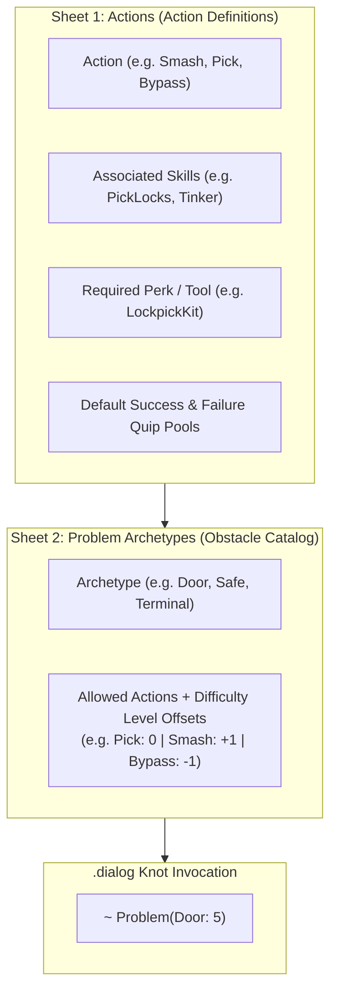

# Google Sheets Design Guide: Actions & Problem Archetypes

This document provides the exact spreadsheet column structures, formatting rules, and real-world examples for setting up your Google Sheets for **Actions** and **Problem Archetypes**.

---

## 1. Architectural Overview

The separation of concerns between your two Google Sheet tabs (or CSVs) is designed as follows:



- **Actions Tab**: Defines *how* things are done, which skills/masteries help, which tool/perk is required, and what quips are said.
- **Archetypes Tab**: Defines the obstacle and lists *which actions can be used*, plus each action's **Level Offset** (+1, -1, 0).
- **Dialogue Script**: Only needs `~ Problem(Door: 5)`.

---

## 2. Sheet 1: `Actions` Specification

This tab registers all physical player methods (e.g., `Smash`, `Pick`, `Bypass`, `Force`, `Disassemble`, `Hack`).

### 2.1 Column Definitions

| Column Header | Type | Description & Permitted Values | Example |
| :--- | :--- | :--- | :--- |
| **`ActionId`** | String / Identifier | Unique enum-friendly name (PascalCase, no spaces). | `Pick`, `Smash`, `Bypass` |
| **`DisplayName`** | String | The text rendered on the choice button. | `Pick the lock`, `Smash it open` |
| **`ApplicableSkills`** | Comma-Separated List | Skills that can contribute bonuses to this action (evaluated against hero's Masteries). | `PickLocks, Tinker` |
| **`RequiredPerk`** | String | Perk or tool required to attempt. Leave blank or `None` if unconstrained. | `LockpickingKit`, `ArcWelder`, `None` |
| **`PerkMode`** | Enum | How to handle missing perks: `ShownWhenLocked` (grayed out with tooltip) or `HiddenWhenLocked` (omitted). | `ShownWhenLocked` |
| **`SuccessQuips`** | Multiline or Semicolon `;` | Pool of method quips displayed in the transcript when the roll passes. | *"With a satisfying click, the tumblers align." ; "You coax the mechanism open."* |
| **`FailureQuips`** | Multiline or Semicolon `;` | Pool of quips displayed in the transcript when the roll fails. | *"The pick binds inside the cylinder." ; "Your tool slips, failing to catch."* |

---

### 2.2 Sheet 1 Example Layout

| ActionId | DisplayName | ApplicableSkills | RequiredPerk | PerkMode | SuccessQuips | FailureQuips |
| :--- | :--- | :--- | :--- | :--- | :--- | :--- |
| **Pick** | Pick mechanism | PickLocks, Tinker | LockpickingKit | ShownWhenLocked | With a satisfying click, the tumblers fall into alignment and the lock gives way. ; Delicate manipulation pops the internal latch. | Your tools slip and bind, failing to catch the rusted tumblers inside. ; The lock refuses to budge and you nearly bend your pick. |
| **Smash** | Smash with brute force | Smash, LiftHeavyObjects | None | None | You deliver a crushing blow that shatters the locking mechanism completely. ; Raw kinetic force splinters the latch from its mounting. | Your strike rattles your bones, but the heavy casing refuses to break. ; The impact glances off without doing real damage. |
| **Bypass** | Bypass circuits | HackCircuits, BreakArcaneCircuits | ArcWelder | ShownWhenLocked | You short-circuit the relay pins, dropping the magnetic seal instantly. ; A neat jump wire feeds enough current to trip the solenoids. | The energy matrix shifts and locks you out with an angry buzz. ; Sparks fly and singe your gloves, but the seal stays locked. |
| **Force** | Lever open | LiftHeavyObjects, Athletics | Crowbar | ShownWhenLocked | With a long heave on the prybar, the metal buckles and pops free. ; Mechanical leverage breaks the rusted weld. | The metal barely flexes, and the lever slips out of your grip. ; You lack the leverage to shift the heavy assembly. |
| **Defuse** | Disarm trigger | DefuseTraps, Perceive | TrapDisarmKit | ShownWhenLocked | With steady hands, you disconnect the trigger mechanism and neutralize the danger. | Your hand slips, and you hear the terrifying click of the trigger engaging. |

---

## 3. Sheet 2: `ProblemArchetypes` Specification

This tab registers recurring obstacles (e.g., `Door`, `Safe`, `Terminal`, `Chasm`, `Boiler`).

### 3.1 Difficulty Math Rule
Every problem in `.dialog` declares a **Base Level** (e.g. `Door: 5`). Each action in the archetype specifies a **`LevelOffset`** ($\Delta$):

$$\text{Final Level} = \text{Base Level} + \text{LevelOffset}$$
$$\text{Target DC} = \text{Final Level} \times 3$$

- **`0`**: Standard difficulty ($\text{Level } 5 \rightarrow \text{DC } 15$).
- **`+1`**: Less optimal approach ($\text{Level } 6 \rightarrow \text{DC } 18$).
- **`-1`**: Favorable / smart approach ($\text{Level } 4 \rightarrow \text{DC } 12$).

---

### 3.2 Archetype Column Definitions (Format Options)

You have two clean ways to arrange this tab in Google Sheets. Choose the one you prefer:

#### Option A: Compact Format (One Row per Archetype — Recommended for Writers)
All actions and offsets for an obstacle are written in a single clean cell using `Action:Offset`:

| Column Header | Description | Example |
| :--- | :--- | :--- |
| **`ArchetypeId`** | Unique obstacle identifier (used in `.dialog`). | `Door`, `Safe`, `Terminal` |
| **`Description`** | Writer notes and physical obstacle concept. | *"Standard reinforced bulkhead or locked door."* |
| **`Actions`** | Comma-separated `ActionId:Offset` pairs. | `Pick:0, Smash:+1, Bypass:-1, Force:0` |

##### Option A Example Table:
| ArchetypeId | Description | Actions |
| :--- | :--- | :--- |
| **Door** | Standard hinged or sliding bulkhead lock. | `Pick:0, Smash:+1, Bypass:-1, Force:0` |
| **Safe** | High-security reinforced safe or lockbox. | `Pick:0, Bypass:0, Smash:+2` |
| **Terminal** | Station computer console or data register. | `Bypass:0, Hack:-1, Smash:+1` |
| **Debris** | Structural collapse or rubble blocking doorway. | `Force:0, Smash:0, Clear:-1` |
| **Trap** | Rigged antipersonnel or wire trigger. | `Defuse:0, Bypass:+1` |

---

#### Option B: Normalized Format (One Row per Action Entry)
If you prefer traditional database-style sheets with dropdowns and individual rows:

| ArchetypeId | Description | ActionId | LevelOffset |
| :--- | :--- | :--- | :---: |
| **Door** | Standard hinged or sliding bulkhead lock. | Pick | `0` |
| | | Smash | `+1` |
| | | Bypass | `-1` |
| | | Force | `0` |
| **Safe** | High-security reinforced safe. | Pick | `0` |
| | | Bypass | `0` |
| | | Smash | `+2` |

*(Both formats can easily be read by our Python / C# importer).*

---

## 4. How It Maps to Your Narrative Writing

Once these two tabs are filled out in Google Sheets:

### 1. In Your Dialogue (`.dialog`):
```text
=== KNOT: ArmoryEntrance ===
NARRATOR: A heavy security hatch protects the armory cache.
~ Problem(Door: 5)
- SUCCESS -> ArmoryInterior
- FAILURE -> ArmoryLockedOut
```

### 2. At Runtime in Unity:
1. `Door` archetype is retrieved.
2. The options are automatically populated on screen:
   - **Pick mechanism**: Level $5 + 0 = 5 \rightarrow$ **DC 15** *(Requires: LockpickingKit)*
   - **Smash with brute force**: Level $5 + 1 = 6 \rightarrow$ **DC 18**
   - **Bypass circuits**: Level $5 - 1 = 4 \rightarrow$ **DC 12** *(Requires: ArcWelder)*
   - **Lever open**: Level $5 + 0 = 5 \rightarrow$ **DC 15** *(Requires: Crowbar)*
3. When clicked, 3d6 are rolled, best matching mastery adds bonus, quip displays in transcript, and the dialogue branches to `ArmoryInterior` or `ArmoryLockedOut`.

---

## 5. Exporting to Unity

When you are ready to update the game:
1. In Google Sheets: **File $\rightarrow$ Download $\rightarrow$ Comma Separated Values (.csv)**.
2. Save them into `Assets/Editor/Data/CSVtoJSON/` as:
   - `Actions.csv`
   - `ProblemArchetypes.csv`
3. Click **Tools $\rightarrow$ CRPG $\rightarrow$ Sync Actions & Archetypes** in Unity (which we will build next) to instantly update `ActionType.cs` and all ScriptableObject assets.
