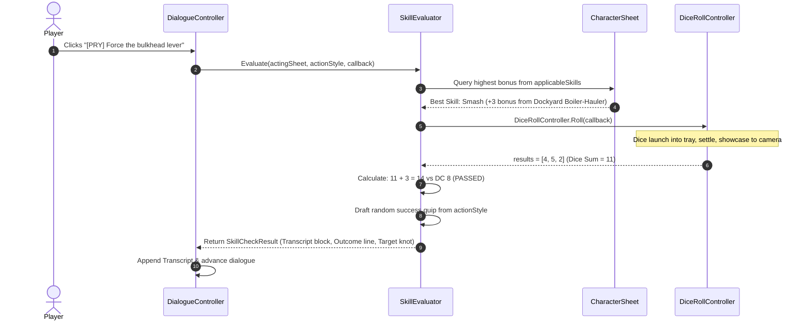

# Hollow Signal — Problem Archetypes & Perk Resolution Roadmap

This document outlines the architectural roadmap and implementation plan for the **Problem Archetype & Perk System**, its integration with **Solo Inventories**, and the **3d6 Physical Dice Evaluation Pipeline** in Hollow Signal.

---

## 1. Architectural Overview & Design Philosophy

### 1.1 The Unified Principle: "Action Style IS the Perk"
Traditional CRPG systems fracture interaction mechanics across disparate models: one table for actions, one table for items, and another for skill perks. 

In **Hollow Signal**, these concepts are unified under a single taxonomy: **`ActionType`**.
- An **Archetype Action Style** (e.g., `Pry`, `Lockpick`, `Hack`, `Break`) defines an approach to overcoming a physical or narrative obstacle.
- An **Equipped Item** grants one or more `ActionType` capabilities (perks) to the character holding it.
- An **Obstacle Action** checks if the acting character possesses the required `ActionType` perk (or if the action is basic and open to bare hands).

```
┌─────────────────────────────────────────────────────────────────────────────────────────┐
│                                   THE UNIFIED TAXONOMY                                  │
│                                                                                         │
│  [ITEM: Pneumatic Crowbar]                                                              │
│    └── EquipFeature Grants: ActionType.Pry                                              │
│                                                                                         │
│  [CHARACTER SHEET: Lucca (Solo Inventory)]                                              │
│    ├── Active Perks: { ActionType.Pry: 1 }                                              │
│    ├── Masteries: Dockyard Boiler-Hauler (+2 LiftHeavyObjects, +3 Smash)                │
│    └── Effective Skills (Black Box): Smash (+3), LiftHeavyObjects (+2)                  │
│                                                                                         │
│  [WORLD OBSTACLE: Seized Bulkhead Hatch (Problem Archetype)]                            │
│    ├── Action Style 1: ActionType.Pry   (Requires Tool: YES | Target DC: 8)             │
│    │     └── Applicable Skills: [LiftHeavyObjects, Smash]                               │
│    └── Action Style 2: ActionType.Break (Requires Tool: NO  | Target DC: 11)            │
│          └── Applicable Skills: [Smash, SwingHammers]                                   │
└─────────────────────────────────────────────────────────────────────────────────────────┘
```

### 1.2 Solo Character Inventories
- Equipment and items belong strictly to the **individual character sheet**, not a shared magic party bag.
- If Lucca equips the crowbar, only Lucca possesses the `Pry` capability.
- If Karen initiates an obstacle dialogue, she cannot select a tool-gated action unless she carries a corresponding tool or possesses that innate capability.

### 1.3 Reference-Counted Perk Tracking
To prevent state bugs where multiple equipped items or conditions grant the same perk (e.g., carrying two crowbars or having both a tool and a background trait):
- Perks are stored in a reference-counted dictionary on `CharacterSheet`: `Dictionary<ActionType, int> _perkCounts`.
- Equipping an item increments the count for each granted perk (`+1`).
- Unequipping decrements the count (`-1`). If the count drops to 0, the perk is removed.
- `HasPerk(actionType)` evaluates whether `_perkCounts[actionType] > 0`.

---

## 2. Data Structures & Engine Contracts

### 2.1 The `ActionType` Enum (`Data.ActionType`)
Represents physical approaches, technical disciplines, and tool capabilities:
```csharp
namespace Data{
    public enum ActionType{
        None = 0,
        Break = 1,
        Pry = 2,
        Lockpick = 3,
        Hack = 4,
        Tinker = 5,
        CutTorch = 6,
        Climb = 7,
        Force = 8
    }
}
```

### 2.2 The `ActionStyle` Model
Encapsulates an approach, difficulty target, tool gating, applicable skills, and flavor quips:
```csharp
namespace Data{
    [Serializable]
    public class ActionStyle{
        public ActionType actionType;
        public bool requiresTool = true;
        public int targetDc;
        public List<Skill> applicableSkills = new();

        [TextArea(2, 3)]
        public List<string> successQuips = new();

        [TextArea(2, 3)]
        public List<string> failureQuips = new();

        /// Evaluates whether the acting character satisfies tool perk requirements.
        public bool CanAttempt(World.Actors.Player.CharacterSheet sheet) =>
            !requiresTool || sheet.HasPerk(actionType);

        /// Drafts a random success quip from the available pool.
        public string GetRandomSuccessQuip() => successQuips[UnityEngine.Random.Range(0, successQuips.Count)];

        /// Drafts a random failure quip from the available pool.
        public string GetRandomFailureQuip() => failureQuips[UnityEngine.Random.Range(0, failureQuips.Count)];
    }
}
```

### 2.3 The `ProblemArchetype` ScriptableObject (`Data.ProblemArchetype`)
Container defining an obstacle category and its constituent action styles:
```csharp
namespace Data{
    [CreateAssetMenu(fileName = "NewProblemArchetype", menuName = "CRPG/Problem Archetype")]
    public class ProblemArchetype : ScriptableObject{
        [SerializeField] private string archetypeId;
        [TextArea(2, 4)]
        [SerializeField] private string description;
        [SerializeField] private List<ActionStyle> actionStyles = new();

        public string Id => archetypeId;
        public string Description => description;
        public IReadOnlyList<ActionStyle> ActionStyles => actionStyles;

        /// Resolves the action style matching a specific action type.
        public ActionStyle GetActionStyle(ActionType type){
            foreach (ActionStyle style in actionStyles)
                if (style.actionType == type)
                    return style;
            return null;
        }
    }
}
```

### 2.4 The `PerkFeature` Equip Contract (`Data.Items.PerkFeature`)
A modular `EquipFeature` subclass placed on `ItemDefinition` ScriptableObjects:
```csharp
namespace Data.Items{
    [CreateAssetMenu(fileName = "NewPerkFeature", menuName = "CRPG/Items/Perk Feature")]
    public class PerkFeature : EquipFeature{
        [SerializeField] private List<ActionType> grantedPerks = new();

        public IReadOnlyList<ActionType> GrantedPerks => grantedPerks;

        /// Increments perk reference counts on the character sheet on equip.
        public override void OnEquip(World.Actors.Player.CharacterSheet user){
            foreach (ActionType perk in grantedPerks)
                user.GrantPerk(perk);
        }

        /// Decrements perk reference counts on the character sheet on unequip.
        public override void OnUnequip(World.Actors.Player.CharacterSheet user){
            foreach (ActionType perk in grantedPerks)
                user.RevokePerk(perk);
        }
    }
}
```

---

## 3. Google Sheets Authoring Pipeline & Schema

To support rapid content authoring, archetypes are designed for direct batch export from Google Sheets to CSV/JSON.

### 3.1 Spreadsheet Column Layout

| Column | Type | Description | Example |
| :--- | :--- | :--- | :--- |
| **`ArchetypeId`** | String | Unique obstacle identifier (repeated for multiple styles or blank after row 1). | `BrokenDoor` |
| **`Description`** | String | Flavor context for designers. | `A reinforced industrial door with a jammed latch.` |
| **`ActionType`** | Enum string | Approach identifier mapping directly to `Data.ActionType`. | `Lockpick` |
| **`RequiresTool`** | Boolean | Whether an acting hero must hold a corresponding perk. | `TRUE` |
| **`TargetDC`** | Integer | Difficulty class rating (standard range: 7–16). | `8` |
| **`ApplicableSkills`**| CSV string | Hidden skills eligible to solve this approach. | `PickLocks, Tinker` |
| **`SuccessQuips`** | Pipe-delimited (`\|`) | Flavor outcomes describing how the obstacle was solved. | `The tumblers click into place... \| With a soft snap, the latch opens...` |
| **`FailureQuips`** | Pipe-delimited (`\|`) | Flavor outcomes describing what failed. | `The pick binds against the cylinder... \| A sickening crunch echoes inside...` |

### 3.2 Example Sheet Representation
```csv
ArchetypeId,Description,ActionType,RequiresTool,TargetDC,ApplicableSkills,SuccessQuips,FailureQuips
BrokenDoor,"Reinforced door jammed in frame.",Lockpick,TRUE,7,"PickLocks, Tinker","The tumblers click into place.|The latch gives with a crisp snap.","The pick binds hard.|The corroded cylinder refuses to turn."
BrokenDoor,,Break,FALSE,9,"Smash, SwingHammers","A brutal shoulder strike splinters the frame.","The frame groans, leaving your shoulder bruised."
SeizedValve,"Industrial steam valve oxidized solid.",Pry,TRUE,8,"LiftHeavyObjects, Smash","Leverage pops the oxidized weld loose.","Your pry-bar slips, showering sparks."
SeizedValve,,Force,FALSE,12,"LiftHeavyObjects","Veins bulge as you force the wheel to turn.","Your grip slips on grease; the wheel doesn't budge."
```

---

## 4. Runtime Skill Evaluation & 3D Dice Resolution Pipeline



### 4.1 Resolution Breakdown Formula
$$\text{Dice Sum} = \text{Die}_1 + \text{Die}_2 + \text{Die}_3$$
$$\text{Skill Bonus} = \text{Clamp}\Big(\text{Sheet.GetEffectiveSkill(BestSkill)}, 0, 4\Big)$$
$$\text{Final Total} = \text{Dice Sum} + \text{Skill Bonus}$$
$$\text{Passed} = \text{Final Total} \ge \text{TargetDC}$$

### 4.2 Transcript Presentation Spec
```text
<b><color=#143447>[ACTION: PRY]</color></b>
Leverage applied to the seized bulkhead spindle.

<b><color=#143447>:: RELEVANT MASTERY: DOCKYARD BOILER-HAULER ::</color></b>
<i><color=#38322B>Years of dislodging frozen valves in the lower shipyards guide your hands to the weakest weld.</color></i>

<b><color=#114A27>[PASSED] // Roll: 4 + 5 + 2 + 3 = 14 vs DC 8</color></b>

<color=#1C1814>"Leverage pops the oxidized weld loose with a sharp metallic report, and the pressure lines bleed off."</color>
```

---

## 5. Phased Implementation Roadmap

### Phase 1: Core Type Foundations
- [ ] Create [`Assets/Scripts/Data/ActionType.cs`](file:///C:/Users/Thiago/Desktop/Personal%20Projects/Horror%20Room/Hollow%20Signal/Hollow%20Signal/Assets/Scripts/Data/ActionType.cs) enum.
- [ ] Create [`Assets/Scripts/Data/ProblemArchetype.cs`](file:///C:/Users/Thiago/Desktop/Personal%20Projects/Horror%20Room/Hollow%20Signal/Hollow%20Signal/Assets/Scripts/Data/ProblemArchetype.cs) with `ActionStyle` list, target DC, tool checks, and quip drafters.

### Phase 2: Solo Inventory & Reference-Counted Perks
- [ ] Update [`Assets/Scripts/World/Actors/Player/CharacterSheet.cs`](file:///C:/Users/Thiago/Desktop/Personal%20Projects/Horror%20Room/Hollow%20Signal/Hollow%20Signal/Assets/Scripts/World/Actors/Player/CharacterSheet.cs) with `Dictionary<ActionType, int> _perkCounts` and `GrantPerk` / `RevokePerk` / `HasPerk` methods.
- [ ] Create [`Assets/Scripts/Data/Items/PerkFeature.cs`](file:///C:/Users/Thiago/Desktop/Personal%20Projects/Horror%20Room/Hollow%20Signal/Hollow%20Signal/Assets/Scripts/Data/Items/PerkFeature.cs) (`EquipFeature`) to bind perks to equipment.

### Phase 3: Skill Evaluator & 3D Dice Integration
- [ ] Create [`Assets/Scripts/Narrative/Skills/SkillEvaluator.cs`](file:///C:/Users/Thiago/Desktop/Personal%20Projects/Horror%20Room/Hollow%20Signal/Hollow%20Signal/Assets/Scripts/Narrative/Skills/SkillEvaluator.cs) containing:
  - Skill bonus deduction across `applicableSkills`.
  - Mastery attribution query.
  - Call to `DiceRollController.Roll(callback)`.
  - Pass/Fail logic and transcript text generator.

### Phase 4: Dialogue System Hookup & Validation
- [ ] Wire `SkillEvaluator` into [`DialogueController.cs`](file:///C:/Users/Thiago/Desktop/Personal%20Projects/Horror%20Room/Hollow%20Signal/Hollow%20Signal/Assets/Scripts/UI/Dialog/DialogueController.cs) knot transitions and choice button availability.
- [ ] Disable / tooltip-tag choices if `ActionStyle.requiresTool == true` and `!sheet.HasPerk(style.actionType)`.
- [ ] Test end-to-end roll in Play Mode using a sample problem archetype in dialogue.
