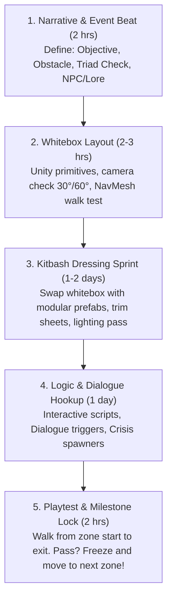

# Hollow Signal — Solo Developer Production Playbook & Pipeline

> **Target Platform:** PC / CRPG  
> **Camera Perspective:** Fixed 3D Orthographic (Pitch: 30° Down, Yaw: 60° Side)  
> **Aesthetic:** Dieselpunk / Cosmic Horror / Planar Inversion  
> **Philosophy:** High Readability, Aggressive Reusability, Rapid Iterative Slices  

---

## 1. The Fixed Orthographic Camera Advantage (30° / 60°)

A fixed orthographic camera (30° pitch, 60° yaw) is the single greatest production shortcut available to a solo developer if exploited properly.

```
       [ FIXED ORTHOGRAPHIC CAMERA: 30° PITCH, 60° YAW ]
                         \
                          \  (Visible: Top & South/East-facing faces)
                           v
                     ┌───────────┐
                     │ ▒▒▒▒▒▒▒▒▒ │ <── Top surface (HIGH visibility)
       Shadow/Hidden │ ▒▒▒▒▒▒▒▒▒ │
       (ZERO detail) │ ▒▒▒▒▒▒▒▒▒ │ <── Front-facing surface (HIGH visibility)
                     └───────────┘
```

### The "Stage Play" Rules for 3D Modeling
1. **The Back-Face Exemption:**
   - Any face pointing North or West (away from the camera) will **never be seen by the player**.
   - Do not bevel, detail, or unwrap backs of walls, rear sides of terminals, or back panels of machinery.
   - For modular walls: build single-sided or L-shaped modular facades. Leave the back open to save polygons and unwrap time.
2. **Exaggerated Silhouettes Over Micro-Detail:**
   - At orthographic distance, tiny bolts, delicate wires, and realistic 2cm chamfers become visual noise or vanish into anti-aliasing.
   - Scale up key elements: pipes should be chunky (15–30cm radius), buttons and levers oversized, rivets and seams bold.
   - Rely on strong edge contrast and readable silhouettes against the floor.
3. **The 3-Plane Value Separation Rule:**
   - **Horizontal Floors:** Medium-dark values, low contrast, subdued saturation. (The player must clearly see character silhouettes and movement paths).
   - **Vertical Walls & Obstacles:** Medium values with high-contrast silhouettes at waist and head heights.
   - **Interactables & Hazards (Pumps, Terminals, Toxic violet water):** Highest saturation or emissive glow (e.g., golden precursor runes, toxic violet luminescence).

---

## 2. Fast Art Asset Manufacturing Pipeline

As a solo developer, you cannot afford to uniquely model, high-poly sculpt, retopologize, UV unwrap, and Substance Painter texture every individual prop. You need a modular kitbash and trim sheet pipeline.

### A. The 3-Master Trim Sheet Strategy
Instead of 50 individual material textures, generate **3 Master Materials/Trim Sheets**:

1. **`M_Industrial_Trim` (Metal & Machinery):**
   - Riveted steel plates, corrugated metal, caution stripes, conduit bundles, ventilation grates.
   - UV mapping is just sliding rectangular polygons over the appropriate stripe or tile.
2. **`M_Architecture_Trim` (Structural Walls & Floors):**
   - Concrete blocks, arched stone masonry, diamond-plate steel catwalk decking, rusted floor panels.
3. **`M_Apparatus_Trim` (Arcanepunk / Relic Tech):**
   - Brass piping, glowing golden runes, vacuum tube glass, gauge dials, switchboards.

### B. Standard Metric Grid & Snapping Rules
To ensure all modular assets snap instantly in Unity without gaps:
- **Floor Tiles:** $2\text{m} \times 2\text{m}$ and $4\text{m} \times 4\text{m}$ (Thickness: $0.2\text{m}$).
- **Wall Sections:** Width $2\text{m}$ or $4\text{m}$, Height $3.5\text{m}$ or $4\text{m}$.
- **Doorway Openings:** Width $2\text{m}$, Height $3\text{m}$.
- **Catwalk / Walkways:** Width $1.5\text{m}$ to $2\text{m}$.
- **Pivots:**
  - Floor tiles: Bottom corner or center.
  - Walls: Bottom-center or bottom-back edge snapped to grid.
  - Props: Bottom-center (so placing on floor snaps cleanly at $Y = 0$).

### C. Folder Structure & Asset Hygiene

```
Hollow Signal/
├── art/                           <-- SOURCE ASSETS (Raw Blender, high-res textures)
│   ├── Blender/
│   │   ├── Architecture/          (Master kitbash .blend files)
│   │   ├── Props/
│   │   └── Characters/
│   └── Textures_Source/           (Photoshop, Affinity, Substance files)
│
└── Assets/                        <-- ENGINE READY (Unity only)
    ├── Art/
    │   ├── Models/
    │   │   ├── Architecture/      (Clean exported .fbx or stripped .blend)
    │   │   ├── Props/
    │   │   └── Characters/
    │   ├── Materials/             (Standard URP / Lit materials)
    │   └── Textures/              (Trim sheets, atlases, decal textures)
    │
    └── Prefabs/
        └── World/
            ├── Architecture/      (Grid-snapped walls, floors, arches with colliders)
            ├── Props_Static/      (Barrels, crates, cables with MeshColliders or BoxColliders)
            └── Props_Interactive/ (Terminals, valves, locked gates with RPG interactive scripts)
```

> [!IMPORTANT]
> **Golden Rule of Scene Building:** Never drag raw meshes into a scene. Always drag **Prefabs** from `Assets/Prefabs/World/`. If you adjust a collider, light offset, or interaction script on the Prefab, every map updates automatically.

---

## 3. The Repeatable "Zone Slicing" Micro-Loop

Avoid trying to "make all the art" or "write all the story" at once. Work in **Micro-Slices** (one tactical zone / room at a time, taking 2 to 4 days per zone).



### Breakdown of the 5 Steps:

#### Step 1: Narrative & Event Beat (Planning)
- **Zone Name & Purpose:** e.g., *Sub-Level 07 Intake Manifold*.
- **The Main Friction:** What stops the party? (e.g., A seized high-pressure valve leaking scalding toxic steam).
- **The 3 Approaches (Triad):**
  - *Force:* Overhaul the rusted wheel with brute physical leverage.
  - *Tinker:* Vent the pressure upstream via auxiliary bypass conduit.
  - *Parley / Lore:* Use precursor knowledge to decipher municipal emergency override valve.
- **The Reward / Consequence:** Passing opens the gate; failing causes party fatigue or triggers an alarm state.

#### Step 2: Whitebox Layout (Spatial Flow)
- Open the Unity scene for the current map.
- Place simple cubes/cylinders for walls, doors, and walkways.
- Bake temporary NavMesh and pilot the player character.
- Verify camera readability: Is any vital pathway obscured by foreground geometry? If yes, lower foreground wall heights to waist height ($1\text{m}$).

#### Step 3: Kitbash Dressing Sprint (Visuals)
- Replace whitebox floors and walls with prefabs from `Assets/Prefabs/World/Architecture/`.
- Add 3–5 narrative set dressing props (e.g., an abandoned tool cart, hanging rubber hoses, warning signs).
- Place key lighting: 1 dominant directional ambient (perpetual purple twilight), and warm localized point lights (industrial cage lamps, valve warning beacons).

#### Step 4: Logic & Dialogue Hookup
- Add interaction triggers (`InteractiveObject`, `DialogueTrigger`, `PerkCheckTrigger`).
- Link the dialogue trees or crisis events defined in Step 1.
- Place sound cues (steam hiss, distant machinery thrum).

#### Step 5: Playtest & Zone Lock
- Play the slice in the Unity Editor.
- If it works mechanically and looks 80% polished, **lock the zone and stop tinkering**. Move immediately to the next connected zone.

---

## 4. Overarching Story Arc & Macro Game Milestones

To prevent aimless development, the entire game is structured into **Four Planar Inversion Strata**. Each stratum contains 3 to 4 tightly designed maps.

```
[ ACT I: THE UNDER-SIPHON ] (Ground Floor / Industrial Underbelly)
├── Siphon Sub-Level 07 (Tutorial / Infiltration / Intake)
├── The Flooded Conduits (Catwalks, toxic fauna, environmental hazards)
└── Pump Station Central (First major boss / Faction crossroads)
         │
         ▼
[ ACT II: THE LOW SPIRE & SCAVENGERS' DISTRICT ] (Slums & Vertical Scarcity)
├── The Iron Steps (Vertical tenements, eviction enforcers, black-market tinkers)
├── St. Eleanor’s Hospice (The sick, corrupted biometal victims, moral crisis)
└── The Reclamation Foundry (Corporate recycling of dead planar exiles)
         │
         ▼
[ ACT III: THE UPPER DISTRICT & COUNCIL PRECINCT ] (Decadence & Arcane Power)
├── The Brass Promenade (Council guards, gilded precursor technology)
├── The Archives of Bren (Cosmic revelation: The True Nature of the Overgod)
└── The High Siphon Spire (Infiltration of the Inversion Control Seat)
         │
         ▼
[ ACT IV: THE INVERSION RING & THE BOUNDARY ] (Cosmic Climax)
├── The Inner Sanctum of the Channeled God (The agonizing sacrifice revealed)
└── The Planar Event Horizon (The Final Triad: Maintain the Lie, Break the Circle, or Ascend)
```

---

## 5. Solo Developer Weekly Cadence (The Sustainable Rhythm)

| Day | Focus | Output |
| :--- | :--- | :--- |
| **Monday** | **Design & Whitebox** | Zone layout, quest beat sheet, dialogue/crisis draft. |
| **Tuesday** | **Modular Art Sprint** | Blender kitbash / prop modeling using Trim Sheets. |
| **Wednesday** | **Prefab & Scene Dressing** | Assemble zone in Unity, setup lighting & colliders. |
| **Thursday** | **Scripting & Events** | Hook up dialogues, RPG skill checks, crisis encounters. |
| **Friday** | **Playtest, Audio & Polish** | Sound FX, particle placement, playtest walkthrough, bug fixes. |
| **Weekend** | **Rest / Story Brainstorm** | No engine work; relax and sketch high-level plot ideas. |

---

## 6. Immediate Next Steps for Hollow Signal

1. **Verify Trim Sheet Asset Base:** Create/refine the core `M_Industrial_Trim` (steel grating, riveted plates, pipes) to texture Sub-Level 07.
2. **Execute Zone 1 (Intake Hallway):** Build the physical blockout for `SiphonSubLevel07` Zone 1 as specified in `SiphonSubLevel07_MapBlueprint.md`.
3. **Hook up Inspector Vane:** Connect the dialogue script and first 3d6 skill check.
