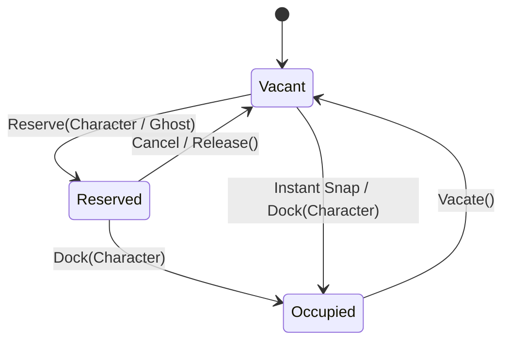

# Hollow Signal — Tactical Command Pipeline & Movement Architecture

## 1. Executive Summary & Purpose

This document outlines the architectural refactoring needed to support turn-based **Crisis Mode**, the **Ghost Planner Avatar**, and **Hazard Traversal Replay** without introducing spaghetti code or regressions into real-time exploration.

Instead of scattering `if (CrisisManager.Instance.IsCrisis)` checks across input, movement, dialogue, and camera scripts, this architecture decouples the system into three distinct, single-responsibility layers:
1. **Raw Input Layer** (Gesture and pointer sensing)
2. **Mode-Based Command Pipeline** (Exploration vs. Crisis command interpretation)
3. **Spatial Navigation & Docking Primitives** (Pure NavMesh movement, slot docking, spatial resolution)

---

## 2. Core Architectural Problems in the Current Codebase

### Problem A: Conflation of Navigation & Gameplay Interaction in `CharacterMovement.cs`
- **Current State:** `CharacterMovement.cs` currently drives both low-level steering (`NavMeshAgent`, velocity animator blends) and high-level gameplay sequences (`InteractionState.Moving -> Aligning -> Using`, `Animator.SetTrigger("Interact")`, `slot.Use()`).
- **Consequence:** Characters cannot simply "walk to and dock into a slot" without automatically triggering the slot's interaction animation and linked dialogue/effect. This forces combat initialization to hack around slot usage triggers.

### Problem B: Monolithic Command Routing in `PlayerCommandDispatcher.cs`
- **Current State:** `PlayerCommandDispatcher` listens directly to gesture events and immediately executes exploration behaviors: multi-unit formation offsets, continuous path updates on mouse hold, and immediate slot usage.
- **Consequence:** Trying to inject turn-based single-unit constraints, ghost delegation, and discrete path planning directly into `PlayerCommandDispatcher` will produce fragile, branching code that risks breaking exploration.

### Problem C: Ad-hoc Slot State Lifecycle in `AreaSlot.cs`
- **Current State:** Slots use loose calls to `Reserve()`, `Claim()`, and `Release()` without an explicit, formal state machine or unified `Dock()` / `Vacate()` handshake.
- **Consequence:** Tracking whether a slot is currently reserved by a Ghost plan vs. occupied by a physical hero is error-prone.

---

## 3. The 3-Tier Layered Architecture

```mermaid
flowchart TD
    subgraph Layer 1: Input & Gesture Sensing
        PGI[PlayerGestureController]
    end

    subgraph Layer 2: Mode-Based Command Pipelines
        Router[PlayerCommandRouter / Active Pipeline]
        ExploPipe[ExplorationCommandPipeline]
        CrisisPipe[CrisisCommandPipeline / Ghost Coordinator]
    end

    subgraph Layer 3: Spatial, Navigation & Docking Primitives
        Nav[CharacterMovement: Pure Navigation & Docking]
        Slot[AreaSlot / TacticalSlot: Slot State Machine]
        Spatial[TacticalSpatialResolver: Zone/Slot Path Math]
        Track[TurnPlanTrack: Waypoint & Hazard Recorder]
    end

    PGI -->|Raw Pointer / Key Events| Router
    Router -->|Exploration Mode| ExploPipe
    Router -->|Crisis Mode| CrisisPipe

    ExploPipe -->|Continuous / Multi-Unit| Nav
    ExploPipe -->|Direct Claim & Use| Slot

    CrisisPipe -->|Single-Unit / Ghost Orders| Nav
    CrisisPipe -->|Resolve Click Target| Spatial
    CrisisPipe -->|Log Milestones| Track
    CrisisPipe -->|Dock Real Hero on Commit| Slot
```

---

## 4. Refactoring Specifications

### Refactoring 1: Pure Navigation & Docking in `CharacterMovement.cs`

**Goal:** Strip high-level interactive triggers (`slot.Use()`, interaction animation state machines) out of `CharacterMovement`. Limit its responsibility strictly to:
1. `MoveTo(Vector3 destination)`: Continuous steering along NavMesh.
2. `MoveToSlot(AreaSlot slot, Action onDocked = null)`: Navigates to a slot position, smoothly aligns rotation to the slot's `anchorPose`, claims the slot, and invokes an optional completion callback (`onDocked`).
3. `Stop()` / `WarpTo(Vector3 position)`: Instant halt or repositioning.

```csharp
// Clean API Surface:
public void MoveToSlot(AreaSlot slot, Action onDocked = null);
```

*High-level consequences (triggering an interact animation, opening dialogue, or executing an effect) become the responsibility of the calling Pipeline, not the movement component.*

---

### Refactoring 2: Formalized Slot State Machine in `AreaSlot.cs`

**Goal:** Unify slot occupancy into a clean, explicit state model:



- **`Vacant`:** Unoccupied and unreserved. Available for selection or fallback assignment.
- **`Reserved`:** Claimed by an acting hero or ghost during their active turn plan.
- **`Occupied`:** The character is physically positioned and aligned in the slot.
- **Methods:**
  - `bool TryReserve(Character character)`
  - `void Dock(Character character)`: Sets `Occupant = character`, sets `character.CurrentSlot = this`.
  - `void Vacate()`: Releases `Occupant` and triggers `OnVacateEffect`.

---

### Refactoring 3: Mode-Based Command Pipeline (`ICommandPipeline`)

**Goal:** Decouple how player commands are interpreted during Exploration vs. Crisis.

```csharp
public interface ICommandPipeline {
    void OnGroundClicked(Vector3 worldPoint);
    void OnSlotClicked(AreaSlot slot);
    void OnCharacterClicked(Character character, bool isAdditive);
    void OnMarqueeBoxSelected(List<Character> enclosedCharacters);
    void OnContinuousMove(Vector3 worldPoint);
}
```

#### Pipeline A: `ExplorationCommandPipeline` (Existing Behavior)
- Multi-unit marquee box selection.
- Continuous repathing on hold (`OnContinuousMove`).
- Click slot $\to$ commands Lead to `MoveToSlot(slot, onDocked: () => slot.Use(lead.sheet))`.

#### Pipeline B: `CrisisCommandPipeline` (Tactical Crisis Behavior)
- Restricts selection to exactly 1 hero (or the Ghost).
- Rejects continuous drag repathing (single discrete destination per order).
- Ground clicks route through `TacticalSpatialResolver.ResolveClickedSlot(...)`.
- Commands the Ghost to move, log waypoints, and preview terminals.
- On commit, replays path traversal on the physical hero.

---

## 5. Benefits for the Ghost Planner & Hazard Traversal Replay

1. **Reusability:** The Ghost and the real hero use the exact same `CharacterMovement.MoveToSlot()` method without special flags or hacks.
2. **Deterministic Replay:** Because `CharacterMovement` only handles navigation and emits `onDocked`, the Crisis Pipeline can queue sequential waypoints and hazards along `TurnPlanTrack` cleanly.
3. **Zero Exploration Side Effects:** Switching modes is a clean pointer swap between pipelines in `PlayerBrain`. Exploration code remains clean and untouched.

---

## 6. Implementation Sequence

| Step | Component | Description |
| :--- | :--- | :--- |
| **Step 1** | `AreaSlot.cs` / `TacticalSlot.cs` | Implement formalized `Dock()`, `Vacate()`, and `TryReserve()` lifecycle. |
| **Step 2** | `CharacterMovement.cs` | Refactor to pure navigation and slot docking (`MoveToSlot(slot, onDocked)`). |
| **Step 3** | `ICommandPipeline` & `PlayerCommandRouter` | Extract `ExplorationCommandPipeline` from `PlayerCommandDispatcher`. |
| **Step 4** | `CrisisCommandPipeline` | Implement single-hero lock, `TacticalSpatialResolver` routing, and combat walk-in. |
| **Step 5** | Ghost Planner & Replay | Hook Ghost avatar and `TurnPlanTrack` execution into the Crisis Pipeline. |
