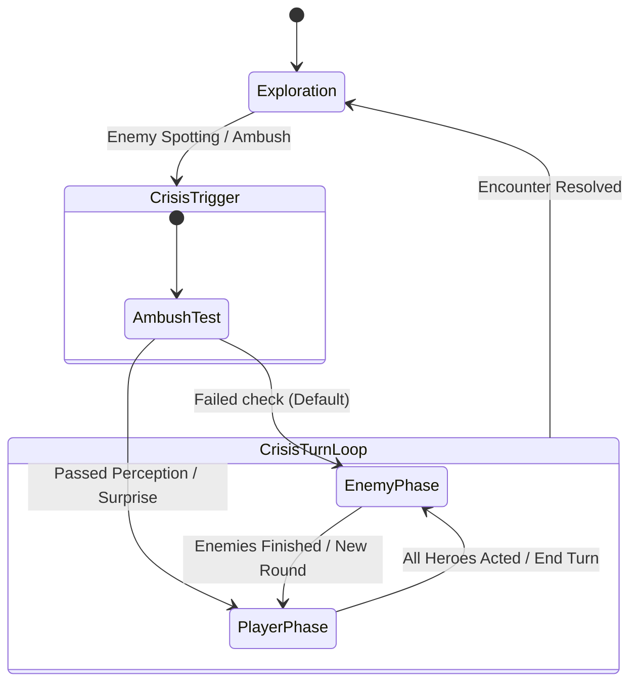

# Hollow Signal — Tactical Zone & Turn-Based Combat System

This document details the architectural design and ruleset for the Crisis (Turn-Based Combat) System in Hollow Signal.

---

## 1. Overview: The Crisis State

Outside of combat, characters navigate the world freely in real-time. When a threat is triggered or an encounter begins, the game transitions into **Crisis Mode** (Turn-Based Tactical Combat).

Instead of a rigid square or hex tile grid, tactical movement is governed by a **Voronoi Zone Graph**:
- Key areas in the environment contain predefined **Tactical Zones** (nodes).
- Each zone contains several predefined **Tactical Spots** (standing points).
- During Crisis, player clicks find the closest zone node, and characters move smoothly between zone spots along the NavMesh.
- The interface emphasizes seamless, organic interaction: players click where they want to go, and UI indicators preview the path, action costs, and required skill checks.

---

## 2. Spatial Topology: Zones & Tactical Slots

### 2.1 Tactical Zones (`TacticalZone`)
- Placed as nodes across key rooms, corridors, and vantage points on the map.
- Connected to neighboring zones in a bidirectional graph to define traversal paths.
- Holds a collection of child **Tactical Spots** (`TacticalSlot`).
- When the player clicks during Crisis, the system raycasts ground coordinates and identifies the closest zone node.

### 2.2 Modular Tactical Spots (`TacticalSlot`)
- Discrete transform positions where characters stand and wait their turn.
- Tracks occupancy state (`Occupant = Character` or free).
- **Extensible Slot Components**: Slots support modular components to grant contextual benefits or hazards to characters standing on them:
  - Skill bonuses (e.g., +1 to Athletics, +1 to Perception).
  - Tactical modifiers (e.g., Low/High Cover, High Ground).
  - Interactive consoles (machine interfaces, computers).
  - Environmental hazards (steam vents, electrified plates).
- **Free Intra-Zone Repositioning**: At the start of a turn, switching to a different free spot within the character's *current* zone is free (0 Movement consumed).

---

## 3. Turn Budget & Action Economy

During each team turn, each character receives an action budget:

| Turn Strategy | Zone Movement | Actions | Condition / Skill Test |
| :--- | :--- | :--- | :--- |
| **Standard Turn** | 1 Zone Move | 1 Action | Default |
| **Double Move** | 2 Zone Moves | 0 Actions | Converts 1 Action into a 2nd Zone Move |
| **Overdrive / Dash** | 2 Zone Moves | 1 Action | **Dash Test Required** |

### The Dash Test & Failure Consequences
- Moving 2 zones while also performing an Action (or moving after having already acted) demands an **Overdrive / Dash Skill Test**.
- The Dash check is rolled against character mastery skills (same dice resolution system as lockpicking, attacking, or searching).
- **Success:** The character successfully completes the second move and performs their action.
- **Failure:** The character halts at the second zone, their turn terminates immediately, and they accumulate a penalty (e.g., Stumble, Disorientation, or Exhaustion status effect).

---

## 4. Command Dissection & Execution Pipeline

Player clicks are dissected into sequential action steps evaluated before execution:

```
[Move 1] ──> [Action / Move 2] ──> [Dash Test (if applicable)] ──> [Pending Action]
```

### Action Chains:
- **Click adjacent zone:** `[Walk, null, (roll), null]`
- **Click adjacent interactive terminal:** `[Walk, Use, (roll), null]`
- **Click terminal 2 zones away:** `[Walk, Walk, (Dash Roll), Use]`

### The Interaction Handshake
- Interactive objects (`IUsable`), attacks, skills, and consumable items all consume the **Action** slot.
- Walking to an interactable terminal does **not** burn the Action immediately upon arrival.
- A confirmation prompt or dialogue window opens at the terminal. Confirming execution consumes the Action; canceling leaves the character at the spot with their Action intact.

---

## 5. Initiative & Team Turn Flow (IGOUGO)

Encounter turns operate on an **IGOUGO** (I Go, You Go) phase system:



1. **Encounter Initiation & Ambush Roll:**
   - When Crisis begins, a preliminary skill roll (e.g., Perception or Hearing) occurs.
   - **Enemies go first by default** unless the party passes the ambush check to seize the initiative.
2. **Player Phase:**
   - The player selects active heroes, inspects candidate zone spots, and issues move/action commands.
   - Turn budgets refresh at the start of each player phase.
   - The phase ends when all heroes have expended their budgets or the player manually triggers "End Turn".
3. **Enemy Phase:**
   - Enemy AI evaluates zone adjacency, occupies tactical slots, executes attacks/skills, and ends their phase.
4. **Resolution:**
   - Once all hostiles are defeated, incapacitated, or escaped, Crisis Mode disengages, restoring real-time exploration.
