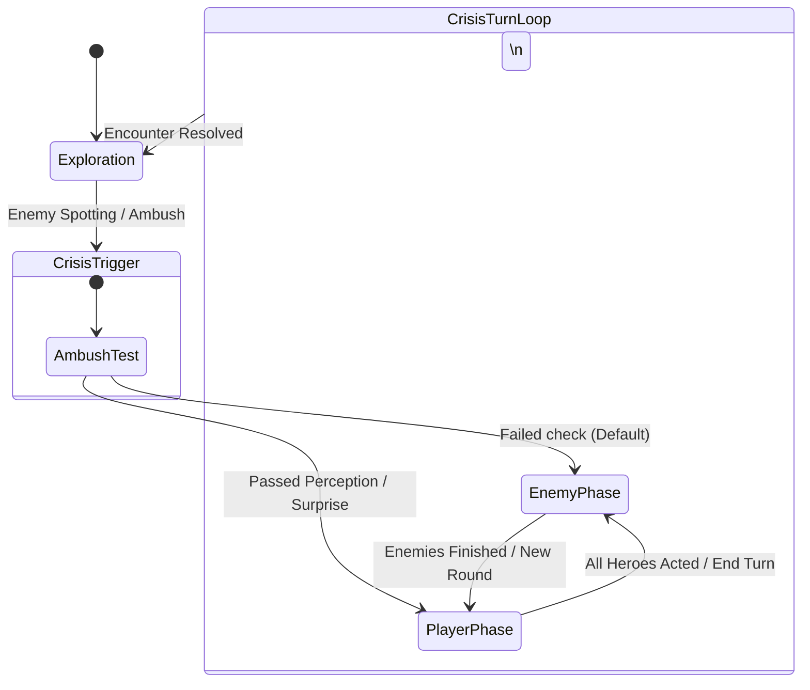

# Hollow Signal — Tactical Zone & Turn-Based Combat System

This document details the architectural design and ruleset for the Crisis (Turn-Based Combat) System in Hollow Signal.

---

## 1. Overview: The Crisis State

Outside of combat, characters navigate the world freely in real-time. When a threat is triggered or an encounter begins, the game transitions into **Crisis Mode** (Turn-Based Tactical Combat).

Instead of a rigid square or hex tile grid, tactical movement is governed by a **Voronoi Zone Graph**:
- Key areas in the environment contain predefined **Tactical Zones** (nodes).
- Each zone contains several predefined **Tactical Spots** (standing points).
- During Crisis, player clicks find the closest zone node, and characters move smoothly between zone spots along the NavMesh.
- The interface emphasizes seamless, organic interaction: players click where they want to go, and UI indicators preview the path, action costs, and required skill checks.

---

## 2. Spatial Topology: Zones & Tactical Slots

### 2.1 Tactical Zones (`TacticalZone`)
- Placed as nodes across key rooms, corridors, and vantage points on the map.
- Connected to neighboring zones in a bidirectional graph to define traversal paths.
- Holds a collection of child **Tactical Spots** (`TacticalSlot`).
- When the player clicks during Crisis, the system raycasts ground coordinates and identifies the closest zone node.

### 2.2 Modular Tactical Spots (`TacticalSlot`)
- Discrete transform positions where characters stand and wait their turn.
- Tracks occupancy state (`Occupant = Character` or free).
- **Extensible Slot Components**: Slots support modular components to grant contextual benefits or hazards to characters standing on them:
  - Skill bonuses (e.g., +1 to Athletics, +1 to Perception).
  - Tactical modifiers (e.g., Low/High Cover, High Ground).
  - Interactive consoles (machine interfaces, computers).
  - Environmental hazards (steam vents, electrified plates).
- **Free Intra-Zone Repositioning**: At the start of a turn, switching to a different free spot within the character's *current* zone is free (0 Movement consumed).

---

## 3. Turn Budget & Action Economy

During each team turn, each character receives a clear, streamlined action budget:

- **Movement:** 1 Zone/Area Move (free).
- **Minor Activation:** 1 Object Interaction (open door, flip switch, pick up a Spark).
- **Action:** 1 Major Action (Attack, Try to Hide, Complex Console Dialogue, Use a Spark, or **Trade Action for a 2nd Zone Move**).

| Turn Strategy | Area Movement | Action | Minor Activation | Condition / Skill Test |
| :--- | :---: | :---: | :---: | :--- |
| **Standard Turn** | 1 Area | 1 Action | 1 Activation | Default turn budget |
| **Double Move** | 2 Areas | 0 Actions | 1 Activation | Converts Action into a 2nd Area Move |
| **Sprint (Move Twice + Act)** | 2 Areas | 1 Action | 1 Activation | **Sprint Test Required (3d6)** |

---

## 4. The Sprint Test (Moving Twice AND Acting)

If a player attempts to move across two areas **and** still execute their Major Action, the system prompts a **Sprint Test**:

### 4.1 The Roll Mechanics
- **The Roll:** **3d6 + Athletics/Mobility Bonus vs DC 11 (Moderate)** (or DC 12 in difficult/muddy terrain).
- **Mastery-Gated Effort:** If the hero possesses a mobility-related Mastery (e.g., *Trench Courier*, *Dockyard Runner*), they may spend **2 Composure** to reroll the lowest die if the initial roll fails.
- **Outcomes:**
  - **Success:** Hero sprints smoothly to the second area with their Action ready to spend.
  - **Failure:** The hero reaches the second area panting; their Action is lost for the turn, and they gain the temporary decorator **`[Winded]`** ($-1$ Defense until next turn).
  - **Critical Fumble (Double 1s):** **`[Stumbled & Sprawled]`** — Knocked prone in open ground, losing all cover benefits until standing up.

### 4.2 Interaction Flow & Dialogue Prompts

The system handles Sprinting through two explicit, simple flows:

```
[CASE 1: Move Twice -> Then Act]
Move 1 (Free) ──> Move 2 (Expends Action) ──> Player clicks an Action/Terminal
                                                  │
                                                  ▼
                                      [Prompt: "Attempt Sprint?"]
                                                  │
                      ┌───────────────────────────┴───────────────────────────┐
                      ▼ [YES]                                                 ▼ [NO]
               Roll Sprint (3d6)                                       Action remains spent;
                      │                                                hero stands in Area 2
         ┌────────────┴────────────┐
         ▼ [PASS]                  ▼ [FAIL]
Opens interaction dialog /     Action lost; hero gains [Winded];
ready to attack (free to       turn ends.
switch actions in same area).
```

- **Case 1 (Move Once $\rightarrow$ Move Twice $\rightarrow$ Try Acting):**
  1. Hero completes free Move 1.
  2. Hero takes a 2nd Move (which by default burns the Action).
  3. The player attempts to perform an Action in the new area (e.g. clicks an enemy or interactive terminal).
  4. The game prompts: *"Attempt Sprint to act this turn?"*
  5. If **Yes**: Rolls Sprint (3d6).
     - **Pass:** Opens the interaction dialogue or targets attack. The player is free to close, re-inspect, or choose any valid action in the current area before finally committing.
     - **Fail:** The Action is lost, `[Winded]` is applied, and the turn ends.
  6. If **No**: The player cancels; the hero remains in the second area without acting.

- **Case 2 (Move Once $\rightarrow$ Act $\rightarrow$ Try Moving Again):**
  1. Hero moves once and completes their Action in Area 1.
  2. The player attempts to move to a 2nd Area.
  3. The game prompts: *"Attempt Sprint to move again?"*
  4. If **Yes**: Rolls Sprint (3d6).
     - **Pass:** Hero moves into the 2nd Area successfully.
     - **Fail:** Hero fails to move, gains `[Winded]`, and the sprint attempt is wasted.
  5. If **No**: The move is canceled; hero stays in Area 1.

---

## 5. Command Dissection & Execution Pipeline

Player clicks are dissected into sequential action steps evaluated before execution:

```
[Move 1] ──> [Action / Move 2] ──> [Sprint Prompt / Roll (if applicable)] ──> [Pending Action]
```

### Action Chains:
- **Click adjacent zone:** `[Walk (Free), null, null]`
- **Click terminal in current/adjacent zone:** `[Walk (Free), Use (Action), null]`
- **Click terminal 2 zones away:** `[Walk (Free), Walk, Sprint Prompt, Use]`

### The Interaction Handshake
- Interactive objects (`IUsable`), attacks, skills, and consumable items all consume the **Action** slot.
- Walking to an interactable terminal does **not** burn the Action immediately upon arrival.
- A confirmation prompt or dialogue window opens at the terminal. Confirming execution consumes the Action; canceling leaves the character at the spot with their Action intact.

---

## 6. Initiative & Team Turn Flow (IGOUGO)

Encounter turns operate on an **IGOUGO** (I Go, You Go) phase system:



1. **Encounter Initiation & Ambush Roll:**
   - When Crisis begins, a preliminary skill roll (e.g., Perception or Hearing) occurs.
   - **Enemies go first by default** unless the party passes the ambush check to seize the initiative.
2. **Player Phase:**
   - The player selects active heroes, inspects candidate zone spots, and issues move/action commands.
   - Turn budgets refresh at the start of each player phase.
   - The phase ends when all heroes have expended their budgets or the player manually triggers \"End Turn\".
3. **Enemy Phase:**
   - Enemy AI evaluates zone adjacency, occupies tactical slots, executes attacks/skills, and ends their phase.
4. **Resolution:**
   - Once all hostiles are defeated, incapacitated, or escaped, Crisis Mode disengages, restoring real-time exploration.
